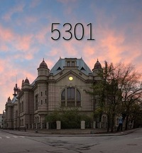

# Ответы на экзаменационные вопросы [ИИ, Новакова, 2018]

Тут будут собраны ответы на вопросы к диф. зачету по дисциплине "Основы искусственного интеллекта".

ЛЭТИ, САПР, 2018

Семестр: 7

Преподаватель: Новакова Н.Е.

