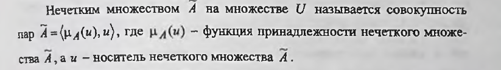
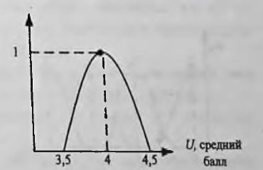
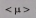
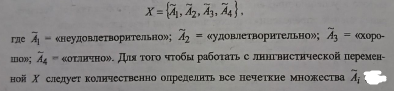
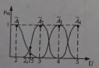
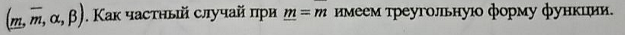
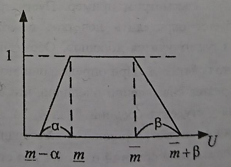

___
# Вопрос 10: Нечеткая логика. Модели нечеткой логики.
___

При работе со многимипредметными областями в базах данных и знаний возникают ситуации, когда мы не можем точно количественно описать какие-либо объекты или явления. Поэтому для успешного принятия решения должны научиться работать с качественными данными и нечетко определёнными понятиями. В связи с этим возникают вопросы:
- как сложить два качественных описания или найти их;

- как выполнить фильтрацию данных, для которых критерии выражаются нечеткими понятиями?

Для ответа на подобные вопросы используется специальный математический аппарат, называемый теорией нечетких множеств, который, как показали несколько последних десятилетий, оказался достаточно жизненным, широко и успешно применяемым в самых различных областях. Рассмотрим основные определения и положения теории нечетких множеств.

Рассмотрим пример. Пусть требуется определить нечеткое понятие «Студент учится хорошо». Обозначим это понятие  . При определении этого понятия совершенно очевидно, что если у студента средний балл 4, то его можно назвать хорошо успевающим. Однако если средний балл 4.4 , то студент учится тоже «хорошо», но уже с некоторым сомнением - а может, «отлично». При среднем балле 3.7, его тоже можно отнести к категории учащихся на «хорошо», но с еще большим сомнением - а может, «удовлетворительно». Наше представление (знание) о понятии «Студент учится хорошо» можно представить графически:

График показывает сомнение или уверенность в том, что студента с некоторым средним баллом можно отнести к «хорошо успевающим». Здесь средний балл является носителем нечеткого множества.

А степень уверенности в том, что значение  принадлежит понятию "хорошо", и есть функция принадлежности. Таким образом, нечёткое множество  и есть не что иное, как попытка количественно описать количественное выражение "хорошо".

Почему функция принадлежности принадлежит интервалу [0 ,1]? Это связано с тем, что в процентах удобно выражать своё отношение. Например, "на 90% доверяю". А если есть абсолютная уверенность, то это 100%-ое доверие, или 1. 

Рассмотри теперь понятие "лингвистическая переменная". Это такая переменная, которая может принимать нечёткие значения.  

Пример:

Определим лингвистическую переменную Х, характеризующую успеваемость студентов. Эта переменная может принимать одно из четырёх возможных значений:

Из рисунка видно, что графики функций принадлежности пересекаются. Это означает, что сложно сказать к какому нечёткому множеству относится средний балл.

В большинстве случаев функции принадлежности строятся субъективно по результатам опроса экспертов, поэтому они являются в некотором смысле приближёнными.

Для того, чтобы было проще вести расчёты используют трапецивидные функции. Тогда функция принадлежности характеризуется четвёркой: 

