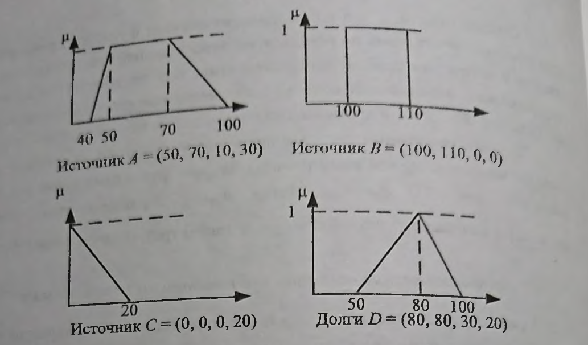
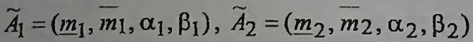
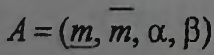
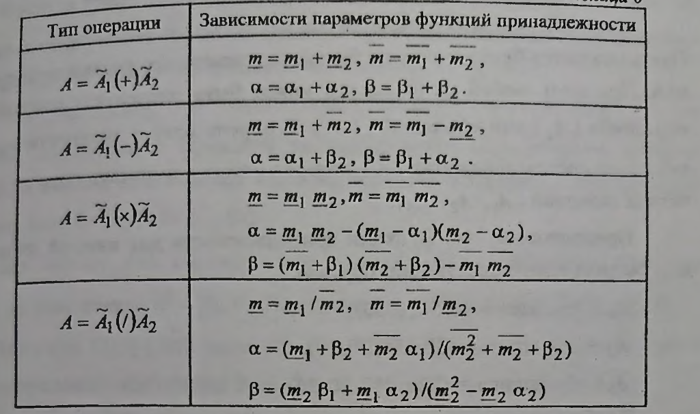
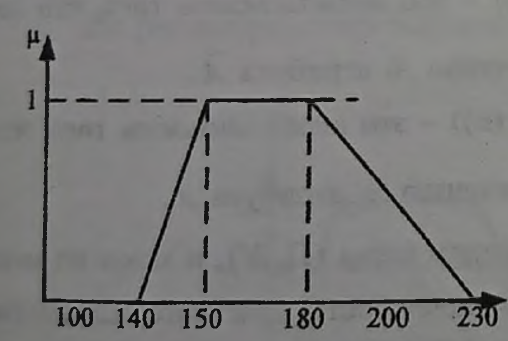
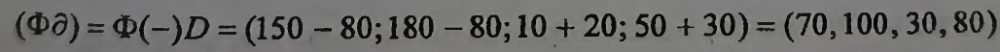
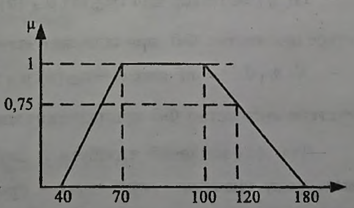

___
# Вопрос 11: Нечеткая логика. Операции над нечеткими переменными.
___

Прежде чем определить простейшие арифметические операции над нечеткими переменными, рассмотрим пример. Пусть в рамках составления проекта бюджета рассматриваются различные источники финансирования, причем некоторые из них характеризуются неточностью оценки денежных сумм па день оценивания, а другие - малой надежностью. Кроме того, из бюджета необходимо отдать долги, количество которых также неточно, так как зависит от того,потребует ли кредитор все или только часть в следующем
финансовом периоде.

- Источник А : сумма финансирования может изменяться от 40 до
100 млн р. в зависимости от конъюнктуры, но с наибольшей вероятностью
можно ожидать поступления в сумме 50...70 млн р.
- Источник В : источник надежен, и разумно полагать, что
финансирование будет предоставлено и составит сумму 100.. .110 млн р.
- Источник С: источник ненадежен, а если и обеспечит
финансирование, то не более 20 млн р.
- Долг D : плата за кредиты 50...100 млн р., но наиболее вероятна
выплата 80 млн р.

Таким образом, имеем три источника поступлений и один источникрасхода. Построим на основе их описании трапециевидные функции принадлежности для каждой из четырех нечетких переменных.

После задания всех нечетких переменных, встает задача определения
суммы всего бюджета, которая также будет нечеткой величиной. А для этого надо уметь выполнять простейшие арифметические операции над нечеткими переменными.

Определение этих операции рассмотрим для случая двух нечетких переменных, которые заданы своими трапециевидными функциями принадлежности вида:

Результатом операции будет также нечеткая переменная 

, 

которая также имеет трапециевидную функцию принадлежности,параметры которой определяются в зависимости от вида арифметической операции.

На основе приведенных описаний арифметических операций можно для рассматриваемого примера определить оценку бюджета без учета долгов (Ф) как сумму трех источников финансирования. Причем результат буде также нечеткой переменной

Ф = А(+)В(+)С = (50 + 100 + 0; 70 + 110 +0; 10 + 0 + 0; 30 + 0 + 20) = (150,180,10,50)

c трапецивидной функцией принадлежности:

Для получения полной оценки предполагаемого бюджета необходимо из полученного результата вычесть предполагаемые платы по кредитам. При этом бюджет с учетом долгов также будет являться нечеткой переменной:

Её функция принадлежности

Таким образом, в бюджете может быть сумма от 40 до 180 млн р., но с наибольшей степенью уверенности можно говорить о суммах от 70 до 100 млн р.