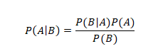
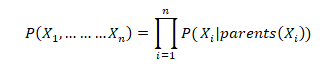
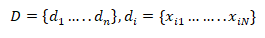
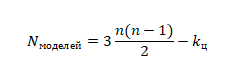
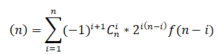
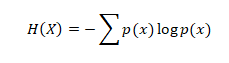
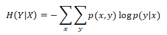
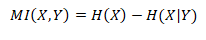

___
# Вопрос 14: Стохастический подход к описанию неопределенностей. Байесовские сети доверия.
___

## Стохастический подход к описанию неопределенностей

 Случайный (стохастический) процесс — это процесс, поведение которого не является детерминированным, и последующее состояние такой системы описывается как величинами, которые могут быть предсказаны, так и случайными.

В рамках теории вероятностей можно определить шансы наступления событий. Можно также описать, как комбинации событий влияют друг на друга. Теория вероятностей строится на предположении о том, что зная частту наступления событий, можно рассуждать о частоте последующих комбинаций событий.

Существует ряд ситуаций, при которых вероятностный анализ является подходящим средством.
Например, если мир является действительно случайным, как при игре хорошо перетасованными картами. А так же этот подход применим, при описании "нормального" мира, т.к не смотря на то, что события могут быть и не случайно, неизвестны их причины и взаимосвязь.

## Байесовские сети доверия

Байесовская сеть (или Байесовская сеть доверия) — это вероятностная модель, представляющая собой множество переменных и их вероятностных зависимостей. Например, байесовская сеть может быть использована для вычисления вероятности того, чем болен пациент по наличию или отсутствию ряда симптомов, основываясь на данных о зависимости между симптомами и болезнями.
В основе байесовской сети доверия лежит теорема Байеса, определенная формулой:

 

P(A) – вероятность гипотезы А

P(B) – вероятность события B

Р(B|A) – в	ероятность наступления события В при истинности гипотезы А

P(A|B) – вероятность гипотезы А при наступлении события В

Формула позволяет вычислить вероятность события по определенной причине.

Формально, байесовская сеть — это направленный ациклический граф, вершины которого представляют переменные, а ребра кодируют условные зависимости между переменными. Вершины могут представлять переменные любых типов, быть взвешенными параметрами, скрытыми переменными или гипотезами. Существуют эффективные методы, которые используются для вычислений и обучения байесовских сетей. Байесовские сети, которые моделируют последовательности переменных, называют динамическими байесовскими сетями. Байесовские сети, в которых могут присутствовать как дискретные переменные, так и непрерывные, называются гибридными байесовскими сетями.

Если ребро выходит из вершины A в вершину B, то A называют родителем B, а B называют потомком A. Множество вершин-предков вершины Xi обозначим как parents(Xi). Совместное распределение значений в вершинах можно удобно расписать как результат локальных распределений в каждом узле и его предках:

Если у вершины Xi нет предков, то его локальное распределение вероятностей называют безусловным, иначе условным. Если значение в узле получено в результате опыта, то вершину называют свидетелем.

Таким образом, байесовские сети доверия позволяют формализовать причинно-следственные связи, протекающие внутри любой системы.

Основной задачей при построении байесовской сети, моделирующей реальный процесс, является установление структуры взаимосвязей показателей. При этом результатом наблюдения таких процессов является набор значений экспериментальных данных.

Где d1-dn – наблюдения за состояние показателей, xi1-xiN – состояние переменных показателей i-го наблюдения.

Решением такой задачи мог бы стать полный перебор, однако такой метод имеет NP-трудную вычислительную сложность – количество моделей для проверки

Где n – количество вершин, Кц – количество циклических моделей.

Для вычисления количества нециклических моделей используется рекурсивное соотношение

Однако, количество моделей при полном переборе при увеличении числа вершин стремительно растет. Следовательно, метод перебора является несостоятельным.

Таким образом, построение байесовкой сети необходимо производить эвристическим методом. Для этого в первую очередь необходимо определить структуру взаимосвязей вершин, установив их взаимное влияние в контексте анализируемого процесса. Вторым этапом построение является обучение сети – то есть присвоение весов взаимосвязям, установление условленных вероятностей.
Для оценки степени взаимосвязанности пар переменных во множестве показателей надежности удобно использовать значение обоюдной информации, которое связано с понятиями энтропии и условной энтропии. Для дискретной случайной величины энтропия с функцией распределения p(x) = p(X = x) определяется как

В свою очередь, условная энтропия для пары дискретных случайных величин Y и X при известном X определяется как

Легко доказать, что H(Y|X) = 0 в случаях, когда Y связан с X функциональной зависимостью, например, Y = g(X). Для всех x: p(x) > 0, значение Y определяется как y = g(x), с вероятностью p(y|x) = 1
Обоюдная показывает количество информации, которую одна случайная переменная содержит о другой. Для двух случайных переменных X и Y с совместной функцией распределения p(x, y) обоюдная информация MI(X, Y) – это относительная энтропия, фактически аналог корреляции, но для информационных показателей

MI = 0 в том случае, когда оцениваемые показатели (вершины графа БСД) являются независимыми друг от друга.
Таким образом, MI > 0 показывает наличие обоюдной информации, или информационной зависимости, между вершинами.
