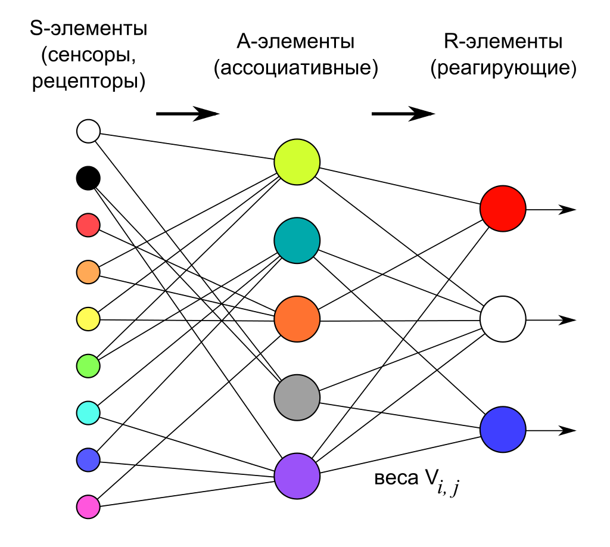

___
# Вопрос 15: Основы искусственных нейронных сетей. Обучение персептрона
___

Перцептро́н, или персептрон (англ. perceptron от лат. perceptio — восприятие; нем. Perzeptron) — математическая или компьютерная модель восприятия информации мозгом (кибернетическая модель мозга), предложенная Фрэнком Розенблаттом в 1957 году и впервые реализованная в виде электронной машины «Марк-1» в 1960 году. Перцептрон стал одной из первых моделей нейросетей, а «Марк-1» — первым в мире нейрокомпьютером.

Перцептрон состоит из трёх типов элементов, а именно: поступающие от датчиков сигналы передаются ассоциативным элементам, а затем реагирующим элементам. Таким образом, перцептроны позволяют создать набор «ассоциаций» между входными стимулами и необходимой реакцией на выходе. В биологическом плане это соответствует преобразованию, например, зрительной информации в физиологический ответ от двигательных нейронов. Согласно современной терминологии, перцептроны могут быть классифицированы как искусственные нейронные сети:
1. с одним скрытым слоем
2. с пороговой передаточной функцией;
3. с прямым распространением сигнала.

### Элементарный персептрон

Элементарный перцептрон состоит из элементов трёх типов: $$S$$-элементов, $$A$$-элементов и одного $$R$$-элемента. $$S$$-элементы — это слой сенсоров или рецепторов. В физическом воплощении они соответствуют, например, светочувствительным клеткам сетчатки глаза или фоторезисторам матрицы камеры. Каждый рецептор может находиться в одном из двух состояний — покоя или возбуждения, и только в последнем случае он передаёт единичный сигнал в следующий слой, ассоциативным элементам.

A-элементы называются ассоциативными, потому что каждому такому элементу, как правило, соответствует целый набор (ассоциация) $$S$$-элементов. $$A$$-элемент активизируется, как только количество сигналов от $$S$$-элементов на его входе превысило некоторую величину θ. Таким образом, если набор соответствующих $$S$$-элементов располагается на сенсорном поле в форме буквы «Д», $$A$$-элемент активизируется, если достаточное количество рецепторов сообщило о появлении «белого пятна света» в их окрестности, то есть $$A$$-элемент будет как бы ассоциирован с наличием/отсутствием буквы «Д» в некоторой области.

Сигналы от возбудившихся $$A$$-элементов, в свою очередь, передаются в сумматор $$R$$, причём сигнал от i-го ассоциативного элемента передаётся с коэффициентом $$ w_i $$. Этот коэффициент называется весом $$A$$—$$R$$ связи.

Так же как и $$A$$-элементы, $$R$$-элемент подсчитывает сумму значений входных сигналов, помноженных на веса (линейную форму). $$R$$-элемент, а вместе с ним и элементарный перцептрон, выдаёт «1», если линейная форма превышает порог $$ \theta $$, иначе на выходе будет «−1». Математически, функцию, реализуемую $$R$$-элементом, можно записать так:

$$
 f( x ) = sign(\sum_{i=1}^{n}w_{i}x_{i}-\theta  )  
$$

Обучение элементарного перцептрона состоит в изменении весовых коэффициентов $$ w_i $$ связей $$A$$—$$R$$. Веса связей $$S$$—$$A$$ (которые могут принимать значения {−1; 0; +1}) и значения порогов $$A$$-элементов выбираются случайным образом в самом начале и затем не изменяются. (Описание алгоритма см. ниже.)

### Обучение персептрона

**Алгоритм обучения персептрона следующий:**
1. Присвоить синаптическим весам $$ w_{1},w_{2}, ... ,w_{N} $$ некоторые начальные значения. Например, нулю.
2. Подать входной образ $$ X $$ и вычислить $$ OUT $$. Если $$ OUT $$ правильный, то переходят к шагу 4. Иначе к шагу 3.
3. Применяя дельта-правило (см. ниже) вычислить новые значения синаптических весов.
4. Повторить шаги 2-4 данного алгоритма обучения персептрона пока сеть не станет выдавать ожидаемый выход на векторах из обучающей выборки или пока отклонение не станет ниже некоторого порога.

Т.о. образом логика обучения персептрона следующая: если сигнал персептрона при некотором образе верен, то ничего корректировать не надо, если нет – производится корректировка весов.
**Правила корректировки весов следующие:**
1. Если $$ OUT $$ неверен и равен нулю, то необходимо увеличить веса тех входов, на которые была подана единица.
2. Если $$ OUT $$ неверен и равен единице, то необходимо уменьшить веса тех входов, на которые была подана единица.

Поясним эти правила. Допустим, что на вход был подан некоторый обучающий двоичный вектор $$ X $$. Этому вектору соответствует выход $$ OUT $$ равный единице. И этот выход неправильный. Тогда веса, присоединенные к единичным входам, должны быть уменьшены, так как они стремятся дать неверный результат. Аналогично, если некоторому другому обучающему вектору $$ X $$ соответствует неправильный выход $$ OUT $$ равный нулю, то веса, присоединенные к единичным входам, должны быть уже уменьшены.

**Дельта-правило**

Дельта-правило является математической моделью правил корректировки весов. Введем величину $$ \delta $$, которая равна разности между требуемым $$ T $$ и реальным $$ OUT $$ выходом:

$$
 \delta = T - OUT 
$$

Тогда, веса персептрона после коррекции будут равны:

$$
 w_{N}(i + 1) = w_{N}(i) + \eta \delta x_{N} 
$$

где:

* $$ i $$ – номер текущей итерации обучения персептрона;
* $$ \eta $$ – коэффициент скорости обучения, позволяет управлять средней величиной изменения весов;
* $$ x_{N} $$ – величина входа соответствующая $$ w_{N} $$ синаптическому весу. Добавление величины $$ x_{N} $$ в произведение позволяет избежать изменение тех весов, которым на входе соответствовал ноль.
