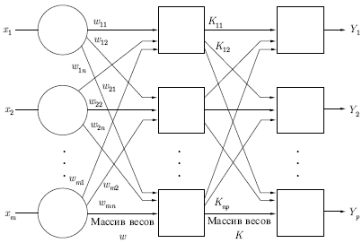
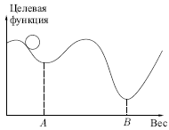
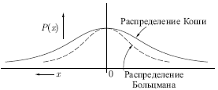
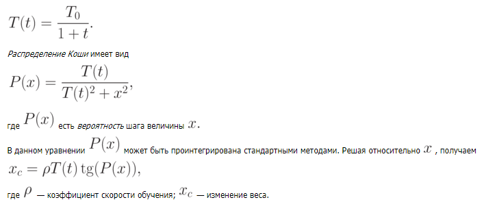

___ 
# Вопрос 17: Применение стохастических методов для обучения искусственных нейронных сетей. 
___ 
Стохастические методы обучения выполняют псевдослучайные изменения величин весов, сохраняя те изменения, которые ведут к улучшениям. Чтобы показать это наглядно, рассмотрим рис. 7.1, на котором изображена типичная сеть, где нейроны соединены с помощью весов. Выход нейрона является здесь взвешенной суммой его входов, которая преобразована с помощью нелинейной функции. Для обучения сети могут быть использованы следующие процедуры: 

 

1) Выбрать вес случайным образом и подкорректировать его на небольшое случайное число. Предъявить множество входов и вычислить получающиеся выходы. 
2) Сравнить эти выходы с желаемыми выходами и вычислить величину разности между ними. Общепринятый метод состоит в нахождении разности между фактическим и желаемым выходами для каждого элемента обучаемой пары, возведение разностей в квадрат и нахождение суммы этих квадратов. Целью обучения является минимизация этой разности, часто называемой целевой функцией. 
3) Выбрать вес случайным образом и подкорректировать его на небольшое случайное значение. Если коррекция помогает (уменьшает целевую функцию), то сохранить ее, в противном случае вернуться к первоначальному значению веса. 
4) Повторять шаги с 1 по 3 до тех пор, пока сеть не будет обучена в достаточной степени. 

Этот процесс стремится минимизировать целевую функцию, но может попасть, как в ловушку, в неудачное решение. На рисунке показано, как это может происходить в системе с единственным весом. Допустим, что первоначально вес взят равным значению в точке A. Если случайные шаги по весу малы, то любые отклонения от точки A увеличивают целевую функцию и будут отвергнуты. Лучшее значение веса, принимаемое в точке B, никогда не будет найдено, и система будет поймана в ловушку локальным минимумом вместо глобального минимума в точке B. Если же случайные коррекции веса очень велики, то как точка A, так и точка B будут часто посещаться, но то же самое будет верно и для каждой другой точки. Вес будет меняться так резко, что он никогда не установится в желаемом минимуме. 

 

Полезная стратегия для избежания подобных проблем состоит в больших начальных шагах и постепенном уменьшении размера среднего случайного шага. Это позволяет сети вырываться из локальных минимумов и в то же время гарантирует окончательную стабилизацию сети. 

**Больцмановское обучение** 

Этот стохастический метод непосредственно применим к обучению искусственных нейронных сетей: 

1) Определить переменную T, представляющую искусственную температуру. Придать T большое начальное значение. 
2) Предъявить сети множество входов и вычислить выходы и целевую функцию. 
3) Дать случайное изменение весу и пересчитать выход сети и изменение целевой функции в соответствии со сделанным изменением веса. 
4) Если целевая функция уменьшилась (улучшилась), то сохранить изменение веса. 

Если изменение веса приводит к увеличению целевой функции, то вероятность сохранения этого изменения вычисляется с помощью распределения Больцмана: 

P(c)=exp(-c/kT), 

где P(c) — вероятность изменения **c** в целевой функции; k — константа, аналогичная константе Больцмана, выбираемая в зависимости от задачи; T — искусственная температура. 
Выбирается случайное число r из равномерного распределения от нуля до единицы. Если P(c) больше, чем r, то изменение сохраняется, в противном случае величина веса возвращается к предыдущему значению. Это позволяет системе делать случайный шаг в направлении, портящем целевую функцию, и дает ей тем самым возможность вырываться из локальных минимумов, где любой малый шаг увеличивает целевую функцию. 

Для завершения больцмановского обучения повторяют шаги 3 и 4 для каждого из весов сети, постепенно уменьшая температуру T, пока не будет достигнуто допустимо низкое значение целевой функции. В этот момент предъявляется другой входной вектор, и процесс обучения повторяется. Сеть обучается на всех векторах обучающего множества, с возможным
 
повторением, пока целевая функция не станет допустимой для всех них. 

**Обучение Коши** 

 

В этом методе при вычислении величины шага распределение Больцмана заменяется на распределение Коши. Распределение Коши имеет, как показано на рис. выше, более длинные "хвосты", увеличивая тем самым вероятность больших шагов. В действительности, распределение Коши имеет бесконечную (неопределенную) дисперсию. С помощью такого простого изменения максимальная скорость уменьшения температуры становится обратно пропорциональной линейной величине, а не логарифму, как для алгоритма обучения Больцмана. Это резко уменьшает время обучения. Зависимость может быть выражена следующим образом: 

 

Теперь применение метода Монте-Карло становится очень простым. Для нахождения x в этом случае выбирается случайное число из равномерного распределения на открытом интервале (-\pi/2, \pi/2) (необходимо ограничить функцию тангенса). Оно подставляется в формулу выше в качестве P(x), и с помощью текущей температуры вычисляется величина шага.