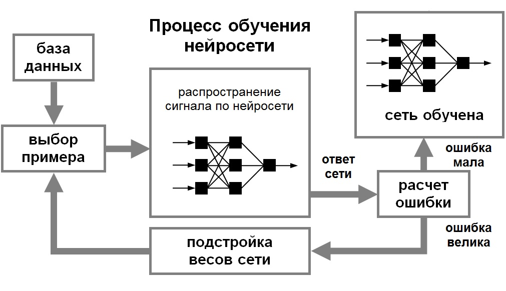

# Вопрос 20: Алгоритмы обучения нейронных сетей. Обучение с учителем и без учителя. 

Обучение нейронной сети- это процесс, в котором параметры нейронной сети настраиваются посредством моделирования среды, в которую эта сеть встроена. Тип обучения определяется способом подстройки параметров. Различают алгоритмы обучения с учителем и без учителя.
Процесс обучения с учителем представляет собой предъявление сети выборки обучающих примеров. Каждый образец подается на входы сети, затем проходит обработку внутри структуры НС, вычисляется выходной сигнал сети, который сравнивается с соответствующим значением целевого вектора, представляющего собой требуемый выход сети. 

Для того, чтобы нейронная сети была способна выполнить поставленную задачу, ее необходимо обучить. Различают алгоритмы обучения с учителем и без учителя.

Процесс обучения с учителем представляет собой предъявление сети выборки обучающих примеров. Каждый образец подается на входы сети, затем проходит обработку внутри структуры НС, вычисляется выходной сигнал сети, который сравнивается с соответствующим значением целевого вектора, представляющего собой требуемый выход сети. Затем по определенному правилу вычисляется ошибка, и происходит изменение весовых коэффициентов связей внутри сети в зависимости от выбранного алгоритма. Векторы обучающего множества предъявляются последовательно, вычисляются ошибки и веса подстраиваются для каждого вектора до тех пор, пока ошибка по всему обучающему массиву не достигнет приемлемо низкого уровня.

При обучении без учителя обучающее множество состоит лишь из входных векторов. Обучающий алгоритм подстраивает веса сети так, чтобы получались согласованные выходные векторы, т.е. чтобы предъявление достаточно близких входных векторов давало одинаковые выходы. Процесс обучения, следовательно, выделяет статистические свойства обучающего множества и группирует сходные векторы в классы. Предъявление на вход вектора из данного класса даст определенный выходной вектор, но до обучения невозможно предсказать, какой выход будет производиться данным классом входных векторов. Следовательно, выходы подобной сети должны трансформироваться в некоторую понятную форму, обусловленную процессом обучения. Это не является серьезной проблемой. Обычно не сложно идентифицировать связь между входом и выходом, установленную сетью.
Для обучения нейронных сетей без учителя применяются сигнальные метод обучения Хебба и Ойа.

Математически процесс обучения  можно описать следующим  образом. В процессе функционирования нейронная сеть формирует выходной сигнал Y, реализуя некоторую функцию Y = G(X). Если архитектура сети задана, то вид функции G определяется значениями синаптических весов и смещенной сети.

Пусть решением некоторой задачи является функция Y = F(X), заданная параметрами входных-выходных данных (X^1, Y^1), (X^2, Y^2), …, (X^N, Y^N), для которых Yk = F(X^k) (k = 1, 2, …, N).

Если выбрано множество обучающих примеров – пар (X^N, Y^N) (где k = 1, 2, …, N) и способ вычисления функции ошибки E, то обучение нейронной сети превращается в задачу многомерной оптимизации, имеющую очень большую размерность, при этом, поскольку функция E может иметь произвольный вид обучение в общем случае – многоэкстремальная невыпуклая задача оптимизации.
