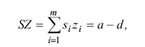
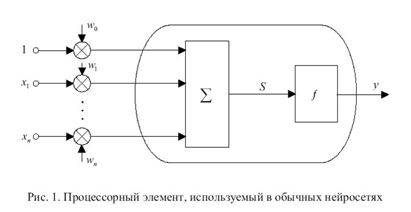
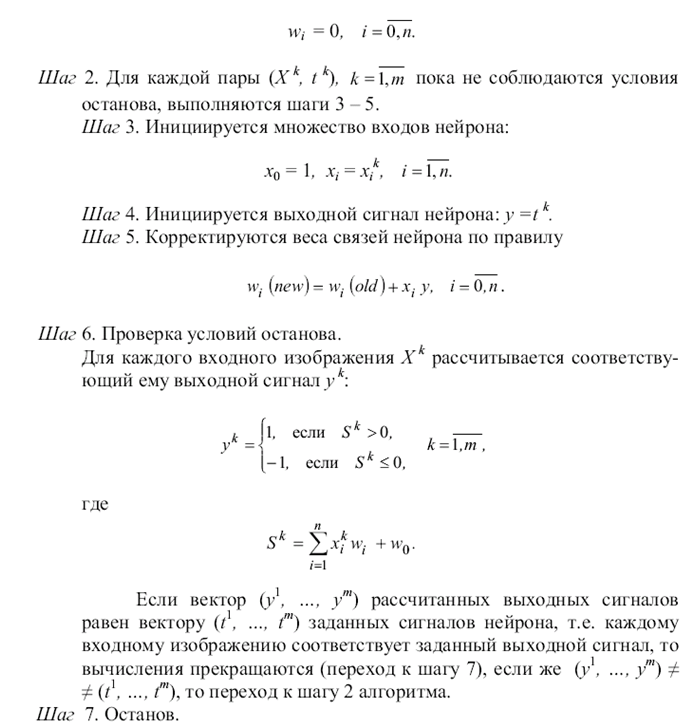
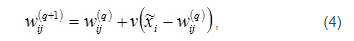

___
# Вопрос 21: Нейронная сеть Хемминга. Нейронная сеть Хебба. Сети Кохонена
___

## Нейронная есть Хемминга

Сеть Хемминга - это одна из наиболее многообещающих распознающих и классифицирующих нейронных сетей. В этой сети черно-белые изображения представляются в виде m-мерных биполярных векторов.

Мера сходства определяется соотношением

R=m-Rx

где m - число компонент входного и эталонных векторов, R- расстояние Хемминга между векторами

Расстояние Хемминга - число компонент, в которых векторы различны

В силу определения расстояния Хемминга мера сходства изображений может быть задана и как число a компонент двоичных векторов в которых они совпадают: К = а.
Запишем для биполярных векторов

S=(s1.....sm) и Z=(z1.....zm)

их скалярное произведение через число совпадающих и отличающихся компонент:

(2)

Отсюда несложно получить :

(3)

Правую часть выражения (3) можно рассматривать как входной сигнал нейрона, имеющего т синапсов с весовыми коэффициентами zi/2 (i=1,m) и вектора S=(s1.....sm).
Такая интерпретация правой части выражения (3) приводит к архитектуре нейронной подсети, изображенной в нижней части рис. 1.

Сеть Хемминга имеет m входных нейронов S1....Sm воспринимающих биполярные компоненты входных изображений. Выходные сигналы S элементов определяются соотношением

(4)

т.е выходной сигнал S-элемента повторяет его входной сигнал.

Функция активации Z-элементов описывается соотношением

(5)

где Uвх - входной сигнал нейрона, k1, Un - константы.

При предъявлении входного изображения S=(s1......sm*) каждый Z-нейрон рассчитывает свой входной сигнал в соответствии с выражением вида

(6)

и с помощью функций активации, определяет выходной сигнал. Выходные сигналы Z элементов являются выходными сигналами a1.....an верхней части подсети.
Функции активации нейронов Ap и веса их связей задаются соотношениями

где e  - константа, удовлетворяющая неравенствами 0<e<=1/n

Сеть функционирует циклически, динамика нейронов описывается итерационным выражением

при начальных условиях

Если среди входных сигналов a1...an нейронов A1.....An имеется один наибольший сигнал a, то в результате итерационного процесса в подсети только один нейрон останется с выходным сигналом большим нуля. А в результате на выходе сети Хемминга только один нейрон Yp станет единичным, что и будет означать, что представленное изображение наиболее близко к эталонному.

## Нейронная сеть Хебба

При моделировании нейронных сетей в качестве искусственных нейронов обычно используется простой процессорный элемент, изображенный на рис. 1. На его входы поступает вектор Х = (х1, …, хп) входных сигналов, являющихся выходными сигналами других нейронов, а также единичный сигнал смещения. Все входные сигналы, включая и сигнал смещения, умножаются на весовые коэффициенты своих связей и суммируются:

(1)

где S –  суммарный входной сигнал; wi – весовые коэффициенты связей входных сигналов х1, …, хп; w0 – весовой коэффициент связи сигнала смещения.

Полученный сигнал S поступает на вход блока, реализующего функцию f активации нейрона. Типичными функциями активации являются бинарная

(2)

или биполярная

(3)

Многие авторы при описании модели нейрона используют не сигнал смещения, а порог  нейрона, что приводит к эквивалентной модели элемента. В этом случае выражения (2) и (3) принимают соответственно вид:

Графическое изображение бинарной и биполярной функций активации для этого случая представлено на рис. 2а и 2b.

Из сопоставления выражений (1) – (3) и (4) – (6) следует, что каждому значению порога  нейрона может быть поставлен в соответствие весовой коэффициент w0 связи сигнала смещения и наоборот.
Реже используются линейные бинарные или биполярные функции активации (рис. 2с и 2d):

где а равно нулю для бинарных выходных сигналов нейронов и а равно минус единице для биполярных сигналов; k, a0 - постоянные коэффициенты.
Кроме приведенных в теории нейронных сетей используются также следующие нелинейные функции активации:
бинарная сигмоидальная или логическая сигмоидальная (рис. 2e):

Искусственные нейронные сети, предназначенные для решения разнообразных конкретных задач, могут содержать от нескольких нейронов до тысяч и даже миллионов элементов. Однако уже отдельный нейрон (рис. 1) с биполярной или бинарной функцией активации может быть использован для решения простых задач распознавания и классификации изображений. Выбор биполярного (1, –1) или бинарного (1, 0) представления сигналов в нейросетях осуществляется исходя из решаемой задачи и во многих случаях он равноценен. Имеется спектр задач, в которых бинарное кодирование сигналов более удобно, однако в общем биполярное представление информации более предпочтительно.
Поскольку выходной сигнал у двоичного нейрона (рис 1) принимает только два значения, то нейрон можно использовать для классификации предъявляемых  изображений  на два класса.
Пусть имеется множество М изображений, для которых известна корректная классификация на два класса X 1 = {X 11, X 12, …, X 1q}, X 2 = {X 21, X 22, …, X 2р},  и пусть первому классу X1 соответствует выходной сигнал у = 1,а классу X2 – сигнал у = –1. Если, например, предъявлено некоторое изображение  и его взвешенная сумма входных сигналов превышает нулевое значение:

то выходной сигнал у = 1 и, следовательно, входное изображение принадлежит классу X1. Если S<=0, то у = –1 и предъявленное изображение принадлежит второму классу.

#### Правило Хебба

Для адаптации, настройки или обучения весов связей нейрона может использоваться несколько методов. Рассмотрим один из них, получивший название “правило Хебба”. Хебб, исследуя механизмы функционирования центральной нервной системы, предположил, что обучение происходит путем усиления связей между нейронами, активность которых совпадает по времени. Хотя в биологических системах это предположение выполняется далеко не всегда и не исчерпывает всех видов обучения, однако при обучении однослойных нейросетей с биполярными сигналами оно весьма эффективно.

## Нейронные сети Кохонена

Нейронные сети Кохонена типичный пример нейросетевой архитектуры, обучающейся без учителя. Отсюда и перечень решаемых ими задач: кластеризация данных или прогнозирование свойств. Кроме того, сети Кохонена могут использоваться с целью уменьшения размерности данных с минимальной потерей информации. В нейронных сетях Кохонена выходные вектора в обучающей выборке могут быть, но могут и отсутствовать, и, в любом случае, они не принимают участия в процессе обучения. То есть выходы не используются в качестве ориентиров при коррекции синапсов. Именно поэтому данный принцип настройки нейронной сети называется самообучением.

В рассматриваемой архитектуре сигнал распространяется от входов к выходам в прямом направлении. Структура нейронной сети содержит единственный слой нейронов (слой Кохонена) без коэффициентов смещения (рис. 1). Общее количество весовых коэффициентов рассчитывается как произведение:

Nw=MK

Количество нейронов равно количеству кластеров, среди которых происходит начальное распределение и последующее перераспределение обучающих примеров. Количество входных переменных нейронной сети равно числу признаков, характеризующих объект исследования и на основе которых происходит отнесение его к одному из кластеров.

Следует различать собственно самообучение и самоорганизацию нейронной сети Кохонена. При обычном самообучении сеть имеет строго фиксированную структуру, т. е. количество нейронов, не изменяющееся на протяжении всего жизненного цикла. При самоорганизации сеть, напротив, не имеет постоянной структуры. В зависимости от найденного расстояния до нейрона-победителя либо этот нейрон используется для кластеризации примера, либо для поданного на входы примера создается новый кластер с соответствующими ему весовыми коэффициентами. Кроме того, в процессе самоорганизации структуры сети Кохонена отдельные нейроны могут исключаться из нее.

Нормализация входных переменных выполняется в пределах [–1, 1] или [0, 1].

Для жизненного цикла нейронных сетей данной архитектуры характерны три основных стадии жизненного цикла: обучение, кластерный анализ и практическое использование.

Алгоритм обучения сети Кохонена включает этапы, состав которых зависит от типа структуры: постоянной (самообучающаяся сеть) или переменной (самоорганизующаяся сеть). Для самообучения последовательно выполняются:

1. Задание структуры сети (количества нейронов слоя Кохонена) (K).

2. Случайная инициализация весовых коэффициентов значениями, удовлетворяющими одному из следующих ограничений:

3. Подача на входы сети случайного обучающего примера текущей эпохи обучения и расчет евклидовых расстояний от входного вектора до центров всех кластеров:

4. По наименьшему из значений Rj выбирается нейрон-победитель j, в наибольшей степени близкий по значениям с входным вектором. Для выбранного нейрона (и только для него) выполняется коррекция весовых коэффициентов:

где v – коэффициент скорости обучения

5. Цикл повторяется с шага 3 до выполнения одного или нескольких условий окончания:

  * исчерпано заданное предельное количество эпох обучения;

  * не произошло значимого изменения весовых коэффициентов в пределах заданной точности на протяжении последней эпохи обучения;

  * исчерпано заданное предельное физическое время обучения.

Коэффициент скорости обучения может задаваться постоянным из пределов (0, 1] или переменным значением, постепенно уменьшающимся от эпохи к эпохе.
