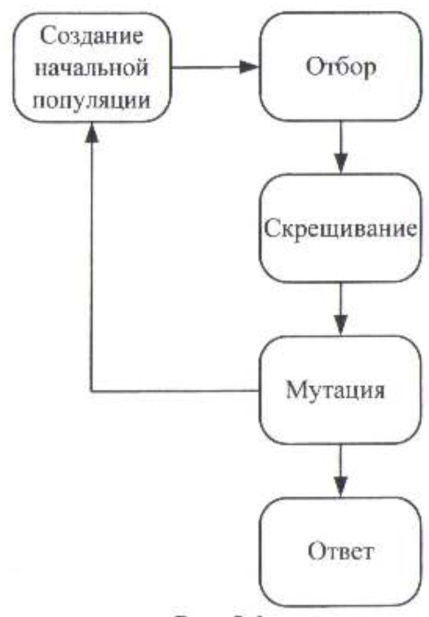
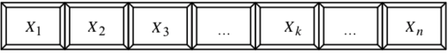

___
# Вопрос 22: Генетические алгоритмы. Адаптивные методы поиска. Области практического применения.
___

Для решения задач функциональной оптимизации в последнее время часто используются адаптивные методы поиска. Представителями таких методов являются генетические алгоритмы.

Адаптивные методы оптимизации основаны на генетических процессах в биологических организмах: биологические популяции развиваются в течение нескольких поколений, подчиняясь законам естественного отбора и принципу «выживает наиболее приспособленный» (survival of the fittest), открытому Чарльзом Дарвиным.

Подражая этому процессу, генетические алгоритмы способны «развивать» решения реальных задач, если те соответствующим образом закодированы. ГА нашли применение в оптимизации, искусственном интеллекте, инженерии знаний и других областях.

На рис. 1 изображена схема работы генетического алгоритма. Вначале генерируется (как правило, случайным образом) начальная популяция особей (индивидуумов), т. е. некоторый набор решений задачи. Затем моделируется размножение внутри данной популяции. Для этого случайно отбираются несколько пар индивидуумов, производится скрещивание между хромосомами в каждой паре, а полученные новые хромосомы помещаются в популяцию нового поколения.

В генетическом алгоритме сохраняется основной принцип естественного отбора – чем приспособленнее индивидуум (чем больше соответствующее ему значение целевой функции), тем с большей вероятностью он будет участвовать в скрещивании. Далее моделируются мутации – в нескольких случайно выбранных особях нового поколения изменяются некоторые гены. Затем старая популяция частично или полностью уничтожается и переходят к рассмотрению следующего поколения.

Популяция следующего поколения в большинстве реализаций генетических алгоритмов содержит столько же особей, сколько и начальная, но в силу отбора приспособленность в ней в среднем выше. Затем описанные процессы отбора, скрещивания и мутации повторяются уже для этой популяции и т. д. [4].

Рисунок 1. Схема работы генетического алгоритма

В каждом следующем поколении будут возникать совершенно новые решения задачи. Среди них как плохие, так и хорошие, но благодаря отбору число хороших решений возрастет. Имитируя эволюцию на компьютере, всегда сохраняется жизнь лучшему из индивидуумов текущего поколения – такая методика называется стратегией элитизма.

Генетический алгоритм работает с некоторой целевой функцией Q(u1,u2,...,un) и в результате находит либо ее максимум, либо минимум
(в зависимости от задачи). Алгоритм оперирует набором параметров u1, u2 , ..., un и находит такое решение, при котором достигается оптимальное
значение функции Q . Для организации работы алгоритма не требуется находить производную от функции Q и выполнять другие вычисления, подразумевающие наличие какой-либо алгебраической функции. Другими словами генетический алгоритм может работать не только с целевой функцией, но и с каким-либо блоком (набором некоторых действий, операций и вычислений), который на вход получает некоторый набор значений u1, u2 ,.., un , а на выходе
выдаёт результат, напрямую зависящий от входящих значений.

Рисунок 2. Входные параметры некоторой системы

Работа генетического алгоритма представляет собой итерационный процесс, который продолжается до тех пор, пока не выполнится заданное число поколений или какой-либо иной критерий остановки.

Итак, есть некоторая система Q , зависящая от нескольких входных параметров u1, u2 , ..., un (рис. 2), и необходимо найти оптимальный набор выходных параметров y , y , ... ym . Входные параметры задачи являются генетическим материалом – генами. Совокупность генов составляет хромосому. Каждая особь обладает своей хромосомой, а следовательно, своим набором параметров. Подав некоторый набор параметров на вход системы Q , можно получить какое-то значение. То, насколько это значение удовлетворяет поставленным условиям, определяет характеристику особи, называемую приспособленностью. Функция, определяющая приспособленность, должна удовлетворять следующему условию: чем «лучше» особь, тем выше приспособленность.

ГА служат, главным образом, для поиска решений в очень больших, сложных пространствах поиска. ГА применяются для решения следующих задач:
* оптимизации многопараметрических функций и запросов в базах данных;
* обучения искусственных нейронных сетей;
* задач компоновки и размещения;
* игровых стратегий;
* составления расписаний и др.

Генетические и эволюционные алгоритмы оптимизации являются алгоритмами случайно-направленного поиска и применяются в основном там, где сложно или невозможно сформулировать задачу в виде, пригодном для более быстрых алгоритмов локальной оптимизации (например, для градиентных алгоритмов). На сегодняшний день ГА хорошо себя зарекомендовали как универсальные методы глобального поиска, которые позволяют находить квазиоптимальные решения за приемлемое время.
