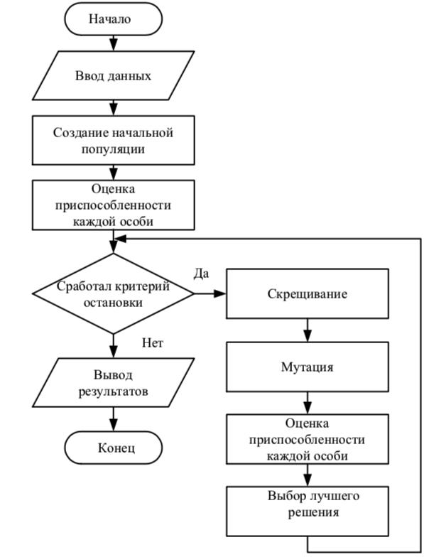
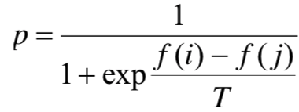

___
# Вопрос 23: Модификации ГА. Стратегии отбора
___

## Модификации ГА
Имеется много модификаций ГА. На рис. 1 приведена блок-схема одной из них. Начальная популяция создается с использованием данных, которые вводятся при запуске программы. Каждая особь созданной популяции оценивается на приспособленность. Далее запускается цикл действий, в котором отобранные лучшие особи последовательно обрабатываются операторами скрещивания, мутации и отбора. Цикл повторяется до тех пор, пока не сработает критерий остановки. В качестве такого критерия используется ограниченное число итераций и результат сравнения лучших решений на настоящем и предыдущем шагах. Если лучшее решение за шаг алгоритма изменилось незначительно, то работа ГА заканчивается.

Рисунок 1

## Стратегии отбора

Рассмотрим различные стратегии отбора родителей.

***Панмиксия***. Это самый простой оператор отбора. В соответствии с данной стратегией каждому члену популяции сопоставляется случайное целое число на отрезке [1; n], где n – количество особей в популяции. Несмотря на простоту, такой подход универсален для решения различных классов задач. Однако он достаточно критичен к численности популяции, поскольку эффективность алгоритма, реализующего такой подход, снижается с ростом численности популяции.

***Селекция***. В данной стратегии родителями могут стать только те особи, значение приспособленности которых не меньше порогового, например среднего значения функции приспособленности. Такой подход обеспечивает более быструю сходимость алгоритма, но не подходит для поиска нескольких экстремумов. Пороговое значение селекции может быть вычислено разными способами, например с применением турнирного и рулеточного (пропорциональные) отборов.

***Ранговый отбор***. Для каждой особи её вероятность попасть в промежуточную популяцию пропорциональна её порядковому номеру в отсортированной по возрастанию приспособленности популяции. Такой вид отбора не зависит от средней приспособленности популяции.
Инбридинг. Первый родитель выбирается случайным образом, а вторым родителем является член популяции, ближайший к первому. Близость определяется, например, как минимальное расстояние Хемминга для бинарных строк или евклидово расстояние между двумя вещественными векторами.

***Аутбридинг***. Использует понятие схожести особей, однако в этой стратегии брачные пары формируются из максимально далёких особей.
Последние 2 способа по-разному влияют на поведение ГА. Инбридинг можно охарактеризовать свойством концентрации поиска в локальных узлах, что приводит к разбиению популяции на группы вокруг подозрительных на экстремумы участков. Аутбридинг же направлен на предупреждение сходимости алгоритма к уже найденным решениям, просматривая новые, неисследованные области.

***Стратегии формирования нового поколения***. Существует 2 основных
типа формирования нового поколения после кроссовера и мутации:

* дети замещают родителей;
*  новое поколение составляется из совокупности и детей, и их родителей.

***Элитарный отбор:*** в новое поколение включается заданное количество лучших особей предыдущего поколения. Иногда этот метод комбинируют с другими. Использование стратегии элитизма не допускает потери лучших решений. К примеру, если популяция сошлась в локальном максимуме, а мутация вывела одну из строк в область глобального, то при замещении родителей весьма вероятно, что эта особь в результате скрещивания будет потеряна и решение задачи не будет получено. Если же используется элитизм, то полученное хорошее решение будет оставаться в популяции до тех пор, пока не будет найдено лучшее.

***Отбор вытеснением.*** В данном типе отбора выбор особи в новую популяцию зависит не только от степени её пригодности, но и от того, есть ли уже в формируемой популяции особь с аналогичным набором хромосом. Отбор проводится из числа родителей и их потомков. Таким образом, не теряются лучшие решения и постоянно поддерживается разнообразие, что увеличивает привлекательность этого метода в многоэкстремальных задачах.

***Метод отжига (Больцмана).*** Вероятность отбора зависит от управляющего параметра T. Обычно вероятность попадания в новую популяцию вычисляется по следующей формуле:

где f (i) и f (j) – значения целевой функции i -й и j -й особей. Эти номера выбираются случайно. Если значение p окажется больше случайного числа
на интервале (0;1), то в новую популяцию попадёт особь f (i) , иначе f (j) . Данный метод используется для узкого класса задач.
