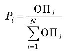
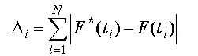
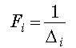
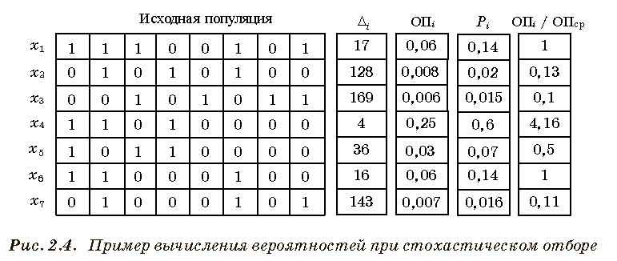
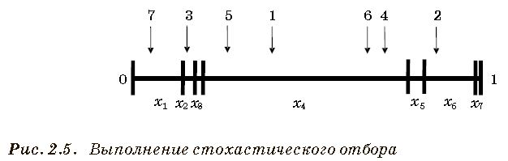
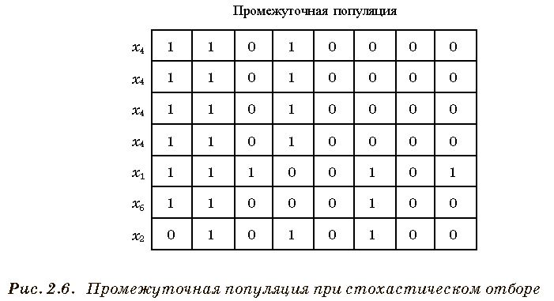

___
# Вопрос 24: Виды селекции в ГА: турнирный и пропорциональный отборы, стохастический универсальный отбор.
___

*Селекция* (другие названия – отбор, репродукция) – это первая генетическая операция, осуществляемая над популяцией. В результате селекции должны быть отобраны хромосомы, которые будут участвовать в процессе генерации новой популяции (популяции потомков). Селекция происходит на основании оценок пригодности хромосом. В итоге возникает промежуточная популяция (mating pool или родительский пул). Промежуточная популяция — это набор особей, которые получили право размножаться. Приспособленные особи могут быть записаны туда несколько раз. «Плохие» особи с большой вероятностью туда вообще не попадут.

В классическом ГА вероятность Pi каждой i-й особи попасть в промежуточную популяцию пропорциональна отношению ее ФП к сумме ФП всех хромосом:

 (24.1)

Такой способ носит название **Пропорциональный отбор** (proportional selection). Его можно реализовать следующим образом: пусть особи располагаются на колесе рулетки так, что размер сектора Si (в процентах) каждой особи соответствует Pi: Si = Pi·100%.

Изначально промежуточная популяция пуста. Затем рулетка запускается N раз, так что каждый раз выбирается хромосома, сектор которой оказался под указателем. В итоге выбирается N особей для записи в промежуточную популяцию. Ни одна выбранная особь не удаляется с рулетки, что позволяет ей много раз претендовать на место в промежуточной популяции. После селекции выполняются операции скрещивания и мутации, которые обобщенно называют рекомбинацией.

**Стохастический отбор**

Простейшим методом селекции является метод колеса рулетки (стохастический отбор с заменой – stochastic sampling).

Стохастический отбор с заменой можно описать и без использования аналогии с колесом рулетки.

1. Хромосомы отображаются в соприкасающиеся отрезки прямой. Длина каждого отрезка соответствует ФП хромосом или, что то же, вероятности выбора хромосомы, ее можно рассчитать по формуле выше.
2. Генерируется случайное число k∈[0, 1] и отбирается хромосома, в отрезок которой попало это число.
3. Процесс повторяется до тех пор, пока не будет отобрано количество хромосом, достаточное для создания промежуточной популяции.

Например, пусть рассматривается задача настройки ИМ. Имеется эталонный процесс F*(t) и процесс F(t), который получается при некоторых параметрах ИМ, кодируемых хромосомой. Тогда для каждой хромосомы можно найти ошибку вида (формула ниже), где N – множество рассматриваемых моментов времени.

Рассмотрим метод колеса рулетки. Здесь можно положить    и вероятность отбора хромосомы вычисляется в соответствии с формулой (24.1).

Допустим, что для кодирования решения используется строка из 8 битов. На рис. 2.4 показан вариант популяции из 7 хромосом, с каждой хромосомой связана ошибка Δi, по которой можно найти Fi и Pi.

Для отбора в родительский пул генерируется 7 случайных чисел в диапазоне от 0 до 1. На рис. 2.5 показано выполнение стохастического отбора (где стрелка соответствует значению случайного числа, а цифра – номер операции выбора).

Таким образом, формируется промежуточная популяция (рис. 2.6).

Здесь лучшая хромосома с номером 4 копируется в промежуточную популяцию несколько раз, в то время как хромосомы с номерами 3 и 7, имеющие низкую пригодность, не попадают в промежуточную популяцию вообще (хотя они имели на это шансы).

Другой способ отбора, который также является пропорциональным, называется *стохастический отбор с остатком* (remainder stochastic sampling). Для каждой особи вычисляется отношение её приспособленности к средней приспособленности популяции. Целая часть этого отношения указывает, сколько раз нужно записать особь в промежуточную популяцию, а дробная — это ее вероятность попасть туда еще раз. Пусть для некоторой особи i отношение её приспособленности к средней приспособленности популяции равно 1,12. Тогда она будет выбрана один раз, а затем с вероятностью 0,12 – еще раз. Реализовать такой способ отбора удобно следующим образом: расположим хромосомы, как было показано на рис. 2.5. Теперь пусть у рулетки не одна стрелка, а N стрелок, причем они отсекают одинаковые сектора. Тогда один запуск рулетки выберет сразу все N особей, которые нужно добавить в промежуточную популяцию.

**Турнирная селекция**

Из популяции, содержащей *N* хромосом, выбирается случайным образом *t* хромосом (тур), и лучшая хромосома из тура попадает в родительскую популяцию, т. е. между выбранными хромосомами проводится турнир. Эта операция повторяется *N* раз.
Размер группы хромосом, отбираемых для турнира, часто равен 2. В этом случае говорят о двоичном/парном турнире (binary tournament). Вообще же величина *t* называется численностью турнира (tournament size). Чем больше турнир, тем более жесткий вариант селекции, т. е. тем меньше шансов у особей с низкой пригодностью.
Преимуществом турнирной селекции является то, что она не требует дополнительных вычислений и упорядочивания строк в популяции по возрастанию приспособленности.

**Селекция отсечением**

В этом способе селекции хромосомы сортируются в соответствии со значением ФП . В родительскую популяцию отбираются только лучшие хромосомы, у которых ФП превышает заданный порог. Остальные хромосомы отбрасываются.

**Элитарная селекция**

Сводится к защите наилучших хромосом на следующих итерациях. В классическом ГА самые приспособленные особи не всегда попадают в следующее поколение. Это значит, что новая популяция не всегда содержит хромосому с максимальным значением ФП из предыдущей популяции. Элитарная стратегия используется для устранения потери такой особи. Эта особь совершенно точно будет в новой популяции.

**Генетический алгоритм с частичной заменой популяции**

Характеризуется тем, что часть популяции переходит в следующее поколение без изменений. Это значит, что входящие в эту часть хромосомы не переносят операции скрещивания и мутации. Часто в конкретных реализациях алгоритма данного типа на каждой итерации заменяются только одна или две особи вместо скрещивания и мутации в объёме всей популяции.
