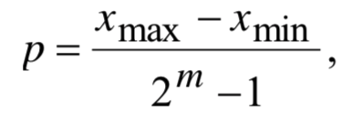
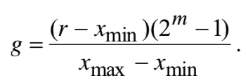
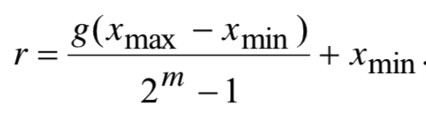

___
# Вопрос 25: Генетический алгоритм. Двоичное и вещественное кодирование. Особенности реализации.
___
Про генетический алгоритм можно прочитать в 22 билете.

***Кодирование хромосом.*** Существует несколько способов кодирования хромосом. При целочисленном кодировании хромосомы представляются в виде последовательности бит. При этом хромосома может принимать только дискретные значения в некотором заданном диапазоне [xmin ; xmax ] с точно-
стью, которая определяется по формуле

где m – длина хромосомы.

Для кодирование вещественной хромосомы r в строку бит g применяется формула

Декодируется хромосома по формуле

При представлении хромосомы в двоичном коде предпочтительнее использовать код Грея, поскольку он обладает свойством непрерывности бинарной комбинации: изменение кодируемого числа на единицу соответствует изменению кодовой комбинации только в одном разряде. Использование кода Грея облегчает функционирование генетического алгоритма, сокращает время, необходимое для его сходимости.

Двоичное представление хромосом влечёт за собой определённые трудности при поиске в непрерывных пространствах большой размерности, а также когда требуется высокая точность найденного решения. Формула выше показывает, что точность p сильно зависит от длины хромосомы m, т. е. точность представления определяется количеством разрядов, используемых для кодирования одной хромосомы. Поэтому при увеличении m пространство поиска расширяется и становится огромным. Следовательно, при неизменной длине хромосомы сокращается точность решения.

Для решения задач в непрерывных пространствах используется генетический алгоритм с вещественным кодированием (Real-coded Genetic Algorithm, RGA). Основная идея RGA заключается в том, чтобы напрямую представлять хромосомы в виде вещественных чисел, т. е. генотип объекта становится идентичным его фенотипу. Точность найденного решения при этом определяется не количеством разрядов битовой строки, а ограничивается возможностями компьютера, на котором реализуется вещественный генетический алгоритм.
