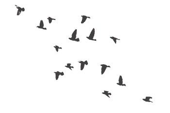
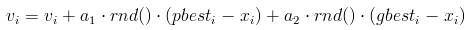
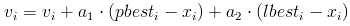
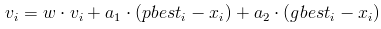
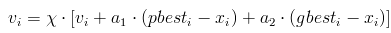
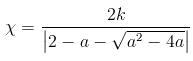
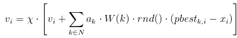

# Вопрос 27: Алгоритм роя частиц.

## Введение

Стая птиц представляет собой прекрасный пример коллективного поведения животных. Летая большими группами, они почти никогда не сталкиваются в воздухе. Стая двигается плавно и скоординировано, словно ей кто-то управляет. А любой, кто вешал в своем дворе кормушку, знает, что спустя несколько часов его найдут все птицы в округе.

Дело тут отнюдь не в вожаке, отдающем приказы – в стаях многих видов птиц его просто нет. Как и колония муравьев или пчел, стая представляет собой роевой интеллект. Птицы в ней действуют согласно определенным – довольно простым – правилам. Кружа в небе, каждая из птиц следит за своими сородичами и координирует свое движение согласно их положению. А найдя источник пищи, она оповестит их об этом.

На последнем факте следует остановиться подробнее, поскольку он играет одну из ключевых ролей в рассматриваемом методе оптимизации. Причины такого «альтруизма» птиц (и других животных, действующих сходным образом) являлись предметом исследования многих социобиологов. Одним из наиболее популярных объяснений этого феномена является то, что преимущества от такого поведения каждой особи стаи больше, чем такие очевидные недостатки, как необходимость борьбы за найденную пищу с другими особями.

Источники пищи обычно расположены случайным образом, поэтому в одиночестве птица вполне может погибнуть, не найдя ни один в течение долгого времени. Однако если все птицы будут «играть по правилам», делясь с сородичами информацией о находках, то шансы каждой из них на выживание резко повышаются. Таким образом, будучи неэффективной для отдельной особи, такая стратегия является залогом эффективности стаи и вида в целом.

## Boids

Наблюдение за птицами вдохновило Крейга Рейнольдса (Craig Reynolds) на создание в 1986 году компьютерной модели, которую он назвал Boids. Для имитации поведения стаи птиц, Рейнольдс запрограммировал поведение каждой из них в отдельности, а также их взаимодействие. При этом он использовал три простых принципа. Во-первых, каждая птица в его модели стремилась избежать столкновений с другими птицами. Во-вторых, каждая птица двигалась в том же направлении, что и находящиеся неподалеку птицы. В-третьих, птицы стремились двигаться на одинаковом расстоянии друг от друга.

Результаты первых же симуляций удивили самого создателя: несмотря на простоту лежащих в основе программы алгоритмов, стая на экране выглядела крайне правдоподобно. Птицы сбивались в группы, уходили от столкновений и даже хаотично метались точь-в-точь как настоящие.

Как специалист в области компьютерной графики, Крейг Рейнольдс был в первую очередь заинтересован визуальной стороной результатов созданной им имитации. Однако, в посвященной Boids статье он также отметил, что разработанная им поведенческая модель может быть расширена введением дополнительных факторов – таких, как поиск пищи или боязнь хищников.

## Классический алгоритм роя частиц

В 1995 году Джеймс Кеннеди (James Kennedy) и Рассел Эберхарт (Russel Eberhart) предложили метод для оптимизации непрерывных нелинейных функций, названный ими алгоритмом роя частиц. Вдохновением для них послужила имитационная модель Рейнольдса, а также работа Хеппнера (Heppner) и Гренадера (Grenader) на схожую тему. Кеннеди и Эберхарт отметили, что обе модели основаны на управлении дистанциями между птицами – а, следовательно, синхронность стаи является в них функцией от усилий, которые птицы прилагают для сохранения оптимальной дистанции.

Разработанный ими алгоритм довольно прост и может быть реализован буквально в нескольких десятках строчек кода на любом высокоуровневом языке программирования. Он моделирует многоагентную систему, где агенты-частицы двигаются к оптимальным решениям, обмениваясь при этом информацией с соседями.

Текущее состояние частицы характеризуется координатами в пространстве решений (то есть, собственно, связанным с ними решением), а также вектором скорости перемещения. Оба этих параметра выбираются случайным образом на этапе инициализации. Кроме того, каждая частица хранит координаты лучшего из найденных ей решений, а также лучшее из пройденных всеми частицами решений – этим имитируется мгновенный обмен информацией между птицами.

На каждой итерации алгоритма направление и длина вектора скорости каждой из частиц изменяются в соответствие со сведениями о найденных оптимумах:

где $$v$$ – вектор скорости частицы ($$v_i$$ – его i-ая компонента), $$a_1$$, $$a_2$$ – постоянные ускорения, $$pbest_i$$ – лучшая найденная частицей точка, $$gbest_i$$ – лучшая точка из пройденных всеми частицами системы, $$x$$ – текущее положение частицы, а функция rnd() возвращает случайное число от 0 до 1 включительно.

После вычисления направления вектора ν, частица перемещается в точку $$x=x+v$$. В случае необходимости, обновляются значения лучших точек для каждой частицы и для всех частиц в целом. После этого цикл повторяется.

## Модификации классического алгоритма

Алгоритм роя частиц появился относительно недавно, однако различными исследователями уже был предложен целый ряд его модификаций, и новые работы на эту тему не перестают публиковаться. Можно выделить несколько путей улучшения классического алгоритма, реализованных в большинстве из них. Это соединение алгоритма с другими алгоритмами оптимизации, уменьшение вероятности преждевременной сходимости путем изменения характеристик движения частиц, а также динамическое изменение параметров алгоритма во время оптимизации. Ниже рассмотрены наиболее примечательные из модификаций.

## LBEST

Позже в том же 1995 году была опубликована статья Кеннеди и Эберхарта, в которой они назвали оригинальный алгоритм “GBEST”, поскольку он использует глобальное лучшее решение (global best) для формирования векторов скоростей, а также предложили его модификацию, названную ими “LBEST”. При обновлении направления и скорости движения частицы в LBEST используют информацию о решениях соседних с ними частиц:

где  – $$lbest_i$$ лучший результат среди частицы и ее соседей. Соседними считаются либо частицы, отличающихся от данной индексом не более чем на некоторое заданное значение, либо частицы, расстояние до которых не превышает заданного порога.

Данный алгоритм более тщательно исследует пространство поиска, однако является более медленным, чем оригинальный. При этом, чем меньшее число соседей учитывается при формировании вектора скорости, тем ниже скорость сходимости алгоритма но тем эффективней он избегает субоптимальных решений.

## Inertia Weighted PSO

В 1998 году Юхи Ши (Yuhui Shi) и Рассел Эберхарт предложили модификацию, на первый взгляд совсем незначительно отличающуюся от классического алгоритма. В своей статье Ши и Эберхарт заметили, что одной из главных проблем при решении задач оптимизации является баланс между тщательностью исследованием пространства поиска и скоростью сходимости алгоритма. В зависимости от задачи и характеристик поискового пространства в ней, этот баланс должен быть различным.

С учетом этого, Ши и Эберхарт предложили изменить правило обновления векторов скоростей частиц:

Коэффициент $$w$$, названный ими коэффициентом инерции, определяет упомянутый баланс между широтой исследования и вниманием к найденным субоптимальным решениям. В случае, когда $$w > 1$$, скорости частиц увеличиваются, они разлетаются в стороны и исследуют пространство более тщательно. В противном случае, скорости частиц со временем уменьшаются, и скорость сходимости в таком случае зависит от выбора параметров $$a_1$$ и $$a_2$$.

## Time-Varying Inertia Weighted PSO

В своей работе 1998 года, Ши и Эберхарт отметили, что инерция не обязательно должна быть положительной константой: она может изменяться во время работы алгоритма по линейному и даже нелинейному закону. В статье 1999 года и более поздних работах они наиболее часто использовали линейный закон убывания, как достаточно эффективный и вместе с тем простой. Тем не менее, разрабатывались и успешно применялись и другие законы изменения инерции.

Значение коэффициента инерции может как убывать, так и расти. При его убывании, частицы сначала исследуют область поиска экстенсивно, находя множество субоптимальных решений, и со временем все более концентрируются на исследовании их окрестностей. Возрастание инерции способствует сходимости алгоритма на поздних стадиях работы.

## Canonical PSO

В 2002 году Марис Клер (Maurice Clerc) и Джеймс Кеннеди предложили свою модификацию алгоритма роя частиц, которая стала настолько популярной, что теперь ее принято называть каноническим алгоритмом роя частиц. Он позволяет избавиться от необходимости «угадывать» подходящие значения регулируемых параметров алгоритма, контролируя сходимость частиц.

Клер и Кеннеди изменили способ вычисления векторов скоростей частиц, введя в него дополнительный множитель:

где $$a = a_1 + a_2 > 4$$, а коэффициент сжатия x равен:

Такой подход гарантирует сходимость алгоритма без необходимости явно контролировать скорость частиц.

## Fully Informed Particle Swarm

В своей работе 2004 года Руи Мендес (Rui Mendes), Джеймс Кеннеди и Жозе Невес (José Neves) заметили, что принятое в каноническом алгоритм роя частиц допущение о том, что на каждую из частиц влияет только наиболее успешная, не соответствует лежащим в его основе природным механизмам и, возможно, ведет к снижению эффективности алгоритма. Они предположили, что из-за чрезмерного внимания алгоритма к единственному решению может быть потеряна важная информация о структуре пространства поиска.

Исходя из этого, они решили сделать все частицы «полностью информированными», то есть получающими информацию от всех соседних частиц. Для этого они изменили в каноническом алгоритме закон изменения скорости:

где N – множество соседей частицы, $$pbest_k$$ – лучшая из пройденных k-ым соседом точек. $$W(k)$$ – весовая функция, которая может отражать любую характеристику k-ой частицы, которая считается важной: значение целевой функции в точке, в которой она находится, дистанцию от нее до данной частицы и так далее.

## Заключение

В первой статье, описывающей алгоритм роя частиц, Джеймс Кеннеди и Рассел Эберхарт высказывали идею использования алгоритм для имитации социального поведения – Кеннеди, как социального психолога, крайне привлекала эта идея [1]. Однако наибольшее распространение алгоритм получил в задачах оптимизации сложных многомерных нелинейных функций.

Алгоритм роя частиц широко применяется, в числе прочих, в задачах машинного обучения (в частности, для обучения нейросетей и распознавания изображений), параметрической и структурной оптимизации (форм, размеров и топологий) в области проектирования, в областях биохимии и биомеханики. По эффективности он может соперничать с другими методами глобальной оптимизации, а низкая алгоритмическая сложность способствует простоте его реализации.

Наиболее перспективными направлениями дальнейших исследований в данном направлении следует считать теоретические исследования причин сходимости алгоритма роя частиц и связанных с этим вопросов из областей роевого интеллекта и теории хаоса, комбинирование различных модификаций алгоритма для решения сложных задач, рассмотрение алгоритма роя частиц как многоагентной вычислительной системы, а также исследование возможностей включения в него аналогов более сложных природных механизмов.