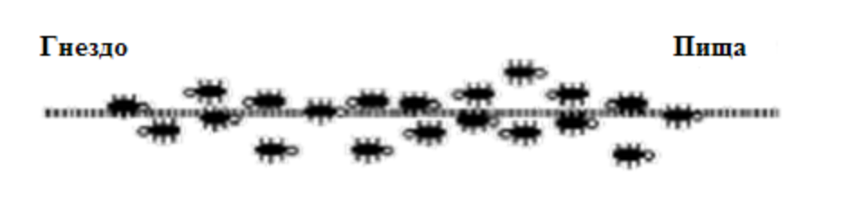
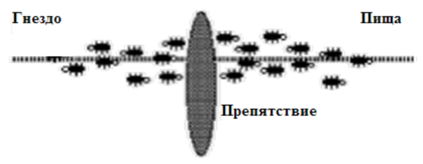
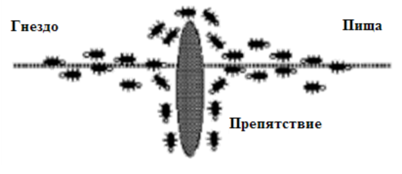
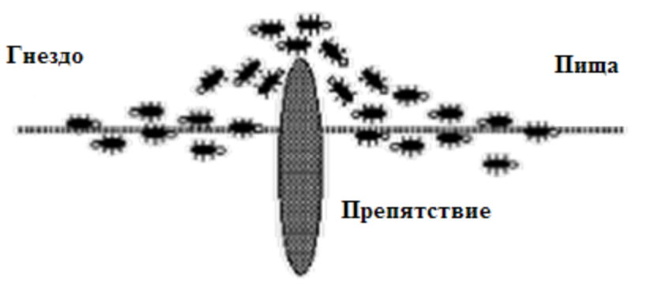
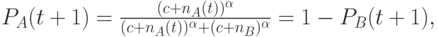
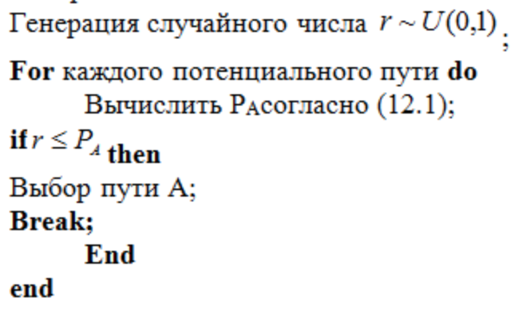

# Вопрос 28. Муравьиный алгоритм

Муравьиные алгоритмы (МА), как и большинство, ранее рассмотренных видов эволюционных алгоритмов, основаны на использовании популяции потенциальных решений и разработаны для решения задач комбинаторной оптимизации, прежде всего, поиска различных путей на графах. Кооперация между особями (искусственными муравьями) здесь реализуется на основе моделирования стигметрии. При этом каждый агент, называемый искусственным муравьем, ищет решение поставленной задачи. Искусственные муравьи последовательно строят решение задачи, передвигаясь по графу, откладывают феромон и при выборе дальнейшего участка пути учитывают концентрацию этого фермента. Чем больше концентрация феромона в последующем участке, тем больше вероятность его выбора.

Реальные муравьи благодаря стигметрии способны находить кратчайший путь от гнезда до источника пищи достаточно быстро и без визуального (прямого контакта). Более того, они способны адаптироваться к изменениям окружающей среды. Были проведены многочисленные эксперименты с реальными муравьями, которые показали следующие результаты.

Движение муравьев без препятствия.

Препятствие на пути между гнездом и пищей.

Начальная фаза движения муравьев с препятствием.

Выбор муравьями кратчайшего пути.

Здесь на первом рисунке показано движение муравьев между гнездом и источником пищи без препятствия. Далее показан характер движения в том случае, когда на пути возникло препятствие.

Из рисунков видно, что при появлении препятствия в начальной фазе движения муравьи с одинаковой вероятностью выбирают и короткий и длинный путь поскольку концентрация феромона сначала одинакова для обоих вариантов. Но по прошествии некоторого времени за счет того, что по короткому пути муравьи быстрее проходят путь, на нем концентрация феромона становится выше и поэтому муравьи выбирают оптимальный путь.

Пусть n_A(t) и n_B(t) обозначают число муравьев на путях A и B соответственно в момент времени t. Эмпирически было найдено, что вероятность выбора моста в момент времени t происходит в соответствии со следующей формулой

где c характеризует степень "привлекательности" неисследованной ветви, и \alpha определяет смещение при использовании феромона в процессе выбора варианта решения. На основе вероятностей правило выбора муравьем моста можно сформулировать следующим образом. Пусть случайным образом генерируется число U(0,1) в интервале (0,1).

Если U(0,1) <= P_A(t+1), то муравей выбирает путь A, иначе – путь B.

Отметим, что несмотря на то, что муравьиная колония демонстрирует сложное адаптивное поведение, которое позволяет ей решать трудные задачи, поведение одного муравья подчиняется достаточно простым правилам. Муравья можно рассматривать как агента, подвергающегося воздействию и формирующего на него соответствующую реакцию: муравей воспринимает концентрацию феромона и на этой основе выполняет действие. Поэтому муравей абстрактно может рассматриваться как простой вычислительный агент. Искусственный муравей алгоритмически моделирует простое поведение реального муравья (точнее его интересующие нас аспекты). Логика поведения искусственного муравья представлена в алгоритме

