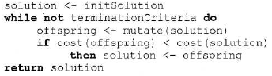
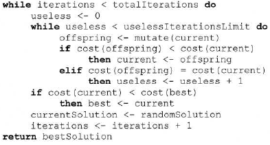
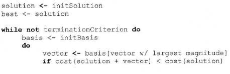
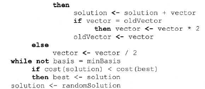
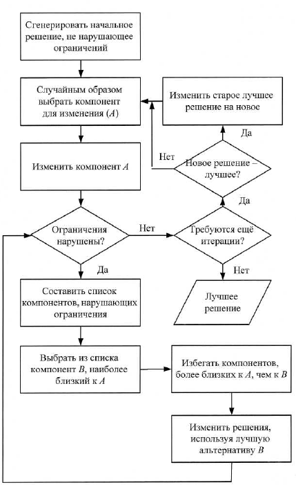

___
# Вопрос 30: Алгоритм подъема и его модификации
___

*Теория после алгоритмов добавлена больше для понимания материала, нежели чем для переписывания.*

На каждой итерации алгоритм создает единственное новое решение, базирующееся на лучшем из найденных ранее решений. Если новое решение лучше исходого, то потомок заменяет родителя и алгоритм переходит к следующей итерации. В противном случае на следующей итерации используется старое решение. Таким образом, алгоритм является жадным – он всегда двигается к лучшему из найденных на данный момент решений.

Опишем работу алгоритма подъему с помощью псевдокода:

В качестве критерия останова terminationCriteria могут применяться такие характеристики, как достижение определенного числа шагов алгорима, ограничение по времени работы алгоритма, отсутствие значительного улучшения значения целевой функции. Могут также использовать такие характеристики, как улучшение самого решения на шаге или на протяжении опредленого числа шагов.

Один из главных недостатков алгоритма подъема заключается в его преждевременной сходимости. Поскольку он всегда использует для получения нового решения лучшее из найденных ранее, он легко может "застрять" в локальном минимуме. Существует несколько модификаций, которые позволяют избежать этого, они будут рассмотрены далее.

***Алгоритм стохастического подъема***. Избежать проблемы преждевременной сходимости алгоритма подъема можно, перезапуская его случайным образом при достижении опредленного условия. Данных алгоритм требует хранения двух решений: лучшего из решений, полученных при текущем запуске алгоритма, и лучшего решения всех запусков. кроме того, следует определить критерий перезапуска, например, если на протяжении болього числа итераций результат существенно не улучшился. Псведокод алгоритма стохастического подъема:

current <- sollution, best <- current, iteration <- 0

Использование такого критерия останова локального поиска гарантирует тщательное исследование области вокруг токи перезапуска. С другой стороны, оно приводит к неопределенной длительности работы алгоритма. Если требуется гарантировать завершение работы алгоритма в заранее известное время, следует производить перезапуск после определенного числа итераций локального поиска.

***Алгоритм динамического подъема***. Алгоритм динамеческого подъема использует последние 2 посещенных решения для генерации единичных векторов в прострастве поиска. Направление поиска нового решения решения, таким образом, подстраивается под структуру пространства поиска. Для работы алгоритма требуется хранение набора ортогональных векторов-решений., образующих базис, а также набора противоположных по знаку векторов. Как и в алгортиме стохастического подъема, внутренний цикл выполняет задачу локального поиска, а внешний отвечает за исследование всей области поиска.

*Внутренний цикл.* На кажой итерации из набора выбирается вектор с наибольшей длинной и вычисляется сумма исходного вектора-решения и выбранного веткора. Если значений целевой функции в точке больше, чем в исходной, происходит перемещение к новому решению и цикл повторяется. В противном случае длина выбраннного вектора уменьшается в двое. Кроме тоого, если алгоритм 2 раза подряд выбирает один и тот же ектор для перехода, длинна этого вектора удваивается.

*Внешний цикл*. Задача внешнего цикла перезапускать описанную процедуру локального поиска с целью максимально тщательного исследования пространства решений. Наиболее эффективный способ выбора точки перезапуска - расположить ее максимально удаленно от вех ранее пройденных алгоритмом точек. Поскольку базис ортогонален, каждая из пройденных точек вместе с базисными векторами делит протсранство поиска на области - n-мерные прямоугольные параллелипипеды. Для перезапуска следует выбирать область наибольшего объема.

**Метод дождевой капли** В оригинальном варианте алгоритма пространство решений и и пространство значений целевой функции совпадают. Алгоритм использует в условиях поиска при жестких ограничениях для допустимых решений. На рисунке представлена блок-схема алгоритма.

В качетве критерия останова алгоритм использует ограничение на число итераций без улучшения решения. Он изменяет один из компонентов решения и следит за соблюдением ограничений. Если ни одно из них не было нарушено, алгоритм переходит к следующей итерации, вновь изменяя решение. Если же новое решение не соответствует ограничениям, алгоритм пытается изменить другой компнент решения, наоиболее близкий к уже измененному, чтобы вернуть решение в рамки ограничений. Если более далекие компоненты выходят за рамки ограничений, то процедура повторяется. В итге каждая подобная итерация приводит к тому, что обе стороны измененного изначального состояния компоненты возвращаются в рамки ограничений.