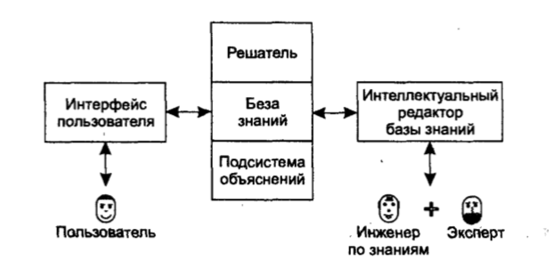

___
# Вопрос 4: Знания экспертов. Экспертные системы (области применения). Архитектура ЭС
___

## Знания экспертов

Экспертные знания - знания, которыми располагает специалист в некоторой предметной области. Экспертные знания являются субъективными.

## Экспертные системы (области применения)

Экспертная система (ЭС) – компьютерная система, использующая знания эксперта для высокоэффективного решения задач в проблемной области и тиражирующая этот эмпирический опыт для консультаций менее квалифицированных пользователей.

Области применения:

1.	Интерпретация – составление смыслового описания ситуации по наблюдаемым данным – распознавание образов, понимание речи и т. п.

2.	Диагностика – определение состояния обекта, обнаружение неисправностей и выявление их причин.

3.	Мониторинг – сравнение результатов наблюдений с ожидаемыми для своевременного обнаружения выхода тех или иных параметров за допустисые пределы (медицинский и экологический мониторинг, атомные электростанции).

4.	Проектирование – создание прототипа, прообраза объекта с зараннее определёнными свойствами.

5.	Прогнозирование – предсказание последствий некоторых событий или явлений на основании анализа имеющихся данных.

6.	Планирование – определение последовательности действий, приводящих к желаемой цели.

7.	Обучение – формирование и коррекция знаний обучаемого в какой-то дисциплине или предмете.

8.	Управление - целенаправленное воздействие на объект.

9.	Поддержка принятия решений – совокупность процедур, обеспечивающая лицо, принимающее решения, необходимой информацией и рекомендациями, облегчающими процесс принятия решения.

## Архитектура ЭС

Обобщенная структура экспертной системы представлена на рисунке ниже. Следует учесть, что реальные ЭС могут иметь более сложную структуру, однако блоки, изображенные на рисунке, непременно присутствуют в любой действительно экспертной системе, поскольку представляют собой стандарт de facto структуры современной ЭС.

В целом процесс функционирования ЭС можно представить следующим образом: пользователь, желающий получить необходимую информацию, через пользовательский интерфейс посылает запрос к ЭС; решатель, пользуясь базой знаний, генерирует и выдает пользователю подходящую рекомендацию, объясняя ход своих рассуждений при помощи подсистемы объяснений.

Пользователь — специалист предметной области, для которого предназначена система. Обычно его квалификация недостаточно высока, и поэтому он нуждается в помощи и поддержке своей деятельности со стороны ЭС. 

Инженер по знаниям — специалист в области искусственного интеллекта, выступающий в роли промежуточного буфера между экспертом и базой знаний. Синонимы: когнитолог, инженер-интерпретатор, аналитик. 

Интерфейс пользователя — комплекс программ, реализующих диалог пользователя с ЭС как на стадии ввода информации, так и при получении результатов. 

База знаний (БЗ) — ядро ЭС, совокупность знаний предметной области, записанная на машинный носитель в форме, понятной эксперту и пользователю (обычно на некотором языке, приближенном к естественному). Параллельно такому «человеческому» представлению существует БЗ во внутреннем «машинном» представлении. 

Решатель — программа, моделирующая ход рассуждений эксперта на основании знаний, имеющихся в БЗ. Синонимы: дедуктивная машина, машина вывода, блок логического вывода. 

Подсистема объяснений — программа, позволяющая пользователю получить ответы на вопросы: «Как была получена та или иная рекомендация?» и «Почему система приняла такое решение?» Ответ на вопрос «как» — это трассировка всего процесса получения решения с указанием использованных фрагментов БЗ, то есть всех шагов цепи умозаключений. Ответ на вопрос «почему» — ссылка на умозаключение, непосредственно предшествовавшее полученному решению, то есть отход на один шаг назад. Развитые подсистемы объяснений поддерживают и другие типы вопросов. 

Интеллектуальный редактор БЗ — программа, представляющая инженеру по знаниям возможность создавать БЗ в диалоговом режиме. Включает в себя систему вложенных меню, шаблонов языка представления знаний, подсказок («help» — режим) и других сервисных средств, облегчающих работу с базой.