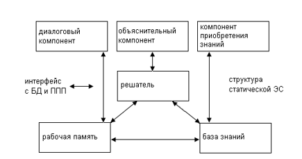

___
# Вопрос 4: Знания экспертов. Экспертные системы (области применения). Архитектура ЭС
___

Цель исследований по ЭС состоит в разработке программ, которые при решении задач, трудных для эксперта-человека, получают результаты, не уступающие по качеству и эффективности решениям, получаемым экспертом. Программные средства (ПС), базирующиеся на технологии ЭС, или инженерии знаний (в дальнейшем будем использовать их как синонимы), получили значительное распространение в мире.

Важность ЭС состоит в следующем:

- технология ЭС существенно расширяет круг практически значимых задач, решаемых на компьютерах, решение которых приносит значительный экономический эффект;
- технология ЭС является важнейшим средством в решении глобальных проблем традиционного программирования: длительность и, следовательно, высокая стоимость разработки сложных приложений;
- объединение технологии ЭС с технологией традиционного программирования добавляет новые качества к программным продуктам за счет: обеспечения динамичной модификации приложений пользователем, а не программистом; большей "прозрачности" приложения (например, знания хранятся на ограниченном ЕЯ (естественный язык), что не требует комментариев к знаниям, упрощает обучение и сопровождение); лучшей графики; интерфейса и взаимодействия.

По мнению ведущих специалистов, в недалекой перспективе ЭС найдут следующее применение:

- ЭС будут играть ведущую роль во всех фазах проектирования, разработки, производства, распределения, продажи, поддержки и оказания услуг;
- технология ЭС, получившая коммерческое распространение, обеспечит революционный прорыв в интеграции приложений из готовых интеллектуально-взаимодействующих модулей.

ЭС предназначены для так называемых неформализованных задач, т.е. ЭС не отвергают и не заменяют традиционного подхода к разработке программ, ориентированного на решение формализованных задач.

Неформализованные задачи обычно обладают следующими особенностями:

- ошибочностью, неоднозначностью, неполнотой и противоречивостью исходных данных;
- ошибочностью, неоднозначностью, неполнотой и противоречивостью знаний о проблемной области и решаемой задаче;
- большой размерностью пространства решения, т.е. перебор при поиске решения весьма велик;
- динамически изменяющимися данными и знаниями.

ЭС и СИИ отличаются от систем обработки данных тем, что в них в основном используются символьный (а не числовой) способ представления, символьный вывод и эвристический поиск решения (а не исполнение известного алгоритма).

ЭС применяются для решения только трудных практических задач. По качеству и эффективности решения экспертные системы не уступают решениям эксперта-человека. Решения экспертных систем обладают "прозрачностью", т.е. могут быть объяснены пользователю на качественном уровне. Это качество экспертных систем обеспечивается их способностью рассуждать о своих знаниях и умозаключениях. ЭС способны пополнять свои знания в ходе взаимодействия с экспертом. Необходимо отметить, что в настоящее время технология экспертных систем используется для решения различных типов задач (интерпретация, предсказание, диагностика, планирование, конструирование, контроль, отладка, инструктаж, управление) в самых разнообразных проблемных областях, таких, как финансы, нефтяная и газовая промышленность, энергетика, транспорт, фармацевтическое производство, космос, металлургия, горное дело, химия, образование, целлюлозно-бумажная промышленность, телекоммуникации и связь и др.

### Структура экспертных систем
 
Статическая ЭС состоит из следующих основных компонентов:
- решателя (интерпретатора);
- рабочей памяти (РП), называемой также базой данных (БД);
- базы знаний (БЗ);
- компонентов приобретения знаний;
- объяснительного компонента;
- диалогового компонента.
 
База данных (рабочая память) предназначена для хранения исходных и промежуточных данных решаемой в текущий момент задачи. Этот термин совпадает по названию, но не по смыслу с термином, используемым в информационно-поисковых системах (ИПС) и системах управления базами данных (СУБД) для обозначения всех данных (в первую очередь долгосрочных), хранимых в системе.

База знаний (БЗ) в ЭС предназначена для хранения долгосрочных данных, описывающих рассматриваемую область (а не текущих данных), и правил, описывающих целесообразные преобразования данных этой области.

Решатель, используя исходные данные из рабочей памяти и знания из БЗ, формирует такую последовательность правил, которые, будучи примененными к исходным данным, приводят к решению задачи.
Компонент приобретения знаний автоматизирует процесс наполнения ЭС знаниями, осуществляемый пользователем-экспертом.

Объяснительный компонент объясняет, как система получила решение задачи (или почему она не получила решение) и какие знания она при этом использовала, что облегчает эксперту тестирование системы и повышает доверие пользователя к полученному результату.
 
Диалоговый компонент ориентирован на организацию дружественного общения с пользователем как в ходе решения задач, так и в процессе приобретения знаний и объяснения результатов работы.

В разработке ЭС участвуют представители следующих специальностей:
- эксперт в проблемной области, задачи которой будет решать ЭС;
- инженер по знаниям - специалист по разработке ЭС (используемые им технологию, методы называют технологией (методами) инженерии знаний);
- программист по разработке ИС, предназначенных для ускорения разработки ЭС.

Необходимо отметить, что отсутствие среди участников разработки инженеров по знаниям (т. е. их замена программистами) либо приводит к неудаче процесс создания ЭС, либо значительно удлиняет его.

Эксперт определяет знания (данные и правила), характеризующие проблемную область, обеспечивает полноту и правильность введенных в ЭС знаний.

Инженер по знаниям помогает эксперту выявить и структурировать знания, необходимые для работы ЭС; осуществляет выбор того ИС, которое наиболее подходит для данной проблемной области, и определяет способ представления знаний в этом ИС; выделяет и программирует (традиционными средствами) стандартные функции (типичные для данной проблемной области), которые будут использоваться в правилах, вводимых экспертом.

Программист разрабатывает ИС (если ИС разрабатывается заново), содержащее в пределе все основные компоненты ЭС, и осуществляет его сопряжение с той средой, в которой оно будет использовано.

ЭС работает в двух режимах: режиме приобретения знаний и в режиме решения задачи (называемом также режимом консультации или режимом использования ЭС).

В режиме приобретения знаний общение с ЭС осуществляет (через посредничество инженера по знаниям) эксперт. В этом режиме эксперт, используя компонент приобретения знаний, наполняет систему знаниями, которые позволяют ЭС в режиме решения самостоятельно (без эксперта) решать задачи из проблемной области. Эксперт описывает проблемную область в виде совокупности данных и правил. Данные определяют объекты, их характеристики и значения, существующие в области экспертизы. Правила определяют способы манипулирования с данными, характерные для рассматриваемой области.