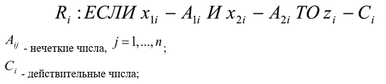
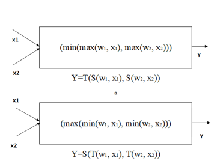
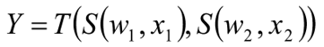
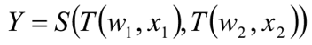
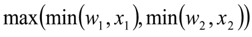
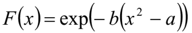

___
# Вопрос 40: Гибридные технологии. Обучение ИНС с помощью ГА и алгоритмов роевого интеллекта. ИНС + нечёткая логика. Другие гибридные технологии
___

Под гибридной интеллектуальной системой (ГиИС) принято понимать систему, в которой для решения задачи используется более одного метода имитации интеллектуальной деятельности человека. Таким образом ГиИС — это совокупность:

- аналитических моделей;
- экспертных систем;
- искусственных нейронных сетей;
- нечетких систем;
- генетических алгоритмов;
- имитационных статистических моделей.

Примером гибридной технологам служит реализация системы нечетких правил на основе нейросетей. База нечетких правил для двух входных и одной выходной переменных имеет следующую структуру:

На основе аналитического обзора существующих классификаций ГиИС предложено выделять следующие пять стратегий разработки ГиИС:

- **Автономные модели** приложений ГиИС содержат независимые программные компоненты, реализующие обработку информации на моделях с использованием методов из ограниченного числа классов. Несмотря на очевидную вырожденность интеграции знаний в этом случае, разработка автономных моделей актуальна и может иметь несколько целей. Такие модели — способ сравнения возможностей решения задачи двумя или более различными методами. Новая автономная модель для решения решенной задачи верифицирует уже созданное приложение и приводит к адекватным моделям. Автономные модели могут использоваться для быстрого создания начального прототипа, после чего разрабатываются приложения, требующие большего времени. Автономные модели имеют и существенный недостаток — никакая из них не может помочь другой в ситуации обновления информации — все должны модифицироваться одновременно.
- **Трансформационные** ГиИС похожи на автономные, так как конечный результат разработки — независимая, не взаимодействующая с другими частями модель. Основное отличие состоит в том, что такая модель начинает работать как система, использующая один автономный метод, а заканчивает как система, использующая уже другой метод. Трансформационные модели дают несколько преимуществ: быстроту создания и меньшие затраты, поскольку эксплуатируется единая модель, а окончательный метод наилучшим образом адаптирует результаты к окружению. Есть и проблемы: автоматическое преобразование одной модели в другую; существенная модификация модели, сравнимая по объёму с разработкой «заново».
- **Слабосвязанные** ГиИС — это, по существу, первая реальная форма интеграции, когда приложение разбивается на отдельные элементы, связываемые через файлы данных. Цепочные ГиИС используют как составные части два функционально завершенных элемента, один из которых — главный процессор, а другой — пре- или постпроцессор. В подчиненных ГиИС составные части — функционально завершенные элементы. Однако в этом случае один из них, подчиненный, включенный в другой, — главный решатель задачи. 
- **Сильносвязанные** ГиИС имеют низкие коммуникационные затраты и более высокую производительность по сравнению со слабосвязанными моделями. Тем не менее, эти ГиИС имеют и три принципиальных ограничения: 1) сложность разработки и поддержки возрастает как следствие внешнего интерфейса данных; 2) сильная связанность страдает от излишнего накопления данных и 3) проверка адекватности затруднена. Рассмотренные слабо- и сильносвязанные ГиИС в силу того, что их состав и структура во многом зависят от решаемой задачи, принято называть ещё и функциональными ГиИС.
- **Полностью интегрированные** ГиИС совместно используют общие структуры данных и представления знаний, а взаимосвязь между компонентами достигается посредством двойственной природы структур. Это бурно развивающийся в мировой практике класс гибридов, где можно выделить разработку концептуальных нейросетей, основанных на знаниях, коннекционистских экспертных систем, в которых элементы взаимодействуют быстро и просто, а общая информация для независимого решения задачи мгновенно доступна тому и другому компоненту. 

#### 
Комбинированные гибридные интеллектуальные системы.

Примером комбинированных гибридных ИС служат гибридные экспертные системы, представляющие собой интеграцию экспертных систем и нейронных сетей и соединяющие как формализуемые знания (в экспертных системах), так и не формализуемые знания (в нейронных сетях).

Нейронная сеть способствует быстрому обучению, в то время как экспертная система позволяет выполнить интерпретацию нечетких данных и объяснить полученное решение. Нейронная сеть может обучаться как с учителем, так и без учителя, может обучаться без переподготовки старой информации.

Нечеткая экспертная система – это экспертная система, объединенная с нечеткими множествами. Экспертная система построена на основе знаний, внедренных в обученную нейронную сеть. Экспертная система прозрачна для пользователя, решения, получаемые экспертной системой, легки для понимания, поскольку правила в базе знаний в «if then» формате используют естественный язык.

Внешние входные данные поступают в гибридную систему как через экспертную систему, так и через нейронную сеть. Выходные данные экспертной системы и нейронной сети поступают на вход модуля, находящего и объясняющего решения.

#### 
Интегрированные гибридные интеллектуальные системы.

В архитектуре интегрированных гибридных ИС главенствует основной модуль-интегратор, который, в зависимости от поставленной цели и текущих условий нахождения решения, выбирает для функционирования те или иные интеллектуальные модули, входящие в систему, и объединяет отклики задействованных модулей.

#### 
Объединенные гибридные интеллектуальные системы.

Характерной особенностью нейронных сетей и генетических алгоритмов является их способность к обучению и адаптации посредством оптимизации. Соединение этих методов с другими методами искусственного интеллекта позволяет увеличить эффективность их способности к обучению. Такую архитектуру гибридной ИС можно отнести к объединенному типу.

Примерами объединенных гибридных ИС могут служить: гибридная экспертная система для инвестиционных рекомендаций, гибридная экспертная система для определения неисправностей в энергетических системах.

#### 
Ассоциативные  гибридные интеллектуальные системы.

Архитектура ассоциативных гибридных систем предполагает, что интеллектуальные модули, входящие в состав такой системы, могут работать как автономно, так и в интеграции с другими модулями. В настоящее время, из-за недостаточного развития систем такого типа, системы с ассоциативной архитектурой еще недостаточно надежны и не получили широкого распространения.

#### 
Распределенные   гибридные интеллектуальные системы.

Следующим уровнем в развитии гибридных систем могут стать распределенные интеллектуальные системы, представляющие мультиагентный подход в области распределенного искусственного интеллекта. При этом подходе каждый функциональный интеллектуальный модуль работает автономно и взаимодействует с другими модулями (агентами) путем передачи сообщений через сеть. Существующие в настоящее время интеллектуальные системы, такие как экспертные системы, нейронные сети и т.п. могут быть преобразованы в агенты.

В процессе преобразования интеллектуальные модули могут быть дополнены управляющими и коммуникативными знаниями, необходимыми для их объединения в мультиагентную интеллектуальную распределенную систему.

#### 
Понятие нечеткой нейросети.

Глубинная интеграция нечетких систем и нейросетей связана с разработкой моделей нейронов, функции которых отличаются от функций традиционного нейрона.
 
Примеры нечетких нейронов: И-нейрон и ИЛИ-нейрон:

Модификация модели нейрона для адаптации к нечетким системам касается выбора функции активации, реализации операций сложения и умножения, так как в нечеткой логике сложение моделируется любой треугольной конормой, а операция умножения — треугольной нормой.

И-нейроном называется нейрон, в котором умножение веса w на вход х моделируется конормой  S(w, x), а сложение нормой T(w, x).

Для двухвходового И-нейрона справедлива формула:

 
ИЛИ-нейроном называется нейрон, в котором умножение веса w и входа х моделируется нормой T(w, x), а сложение взвешенных весов — конормой S(w, x).

Для двухвходового ИЛИ-нейрона справедлива формула:

 
Если выбрать в качестве Т — min, a S — max, то формула преобразования ИЛИ-нейрона уточняется следующим образом:

 
В качестве функции активации обычно используют радиальную базисную функцию:

 
Нечеткой нейронной сетью (ННС) называют четкую нейронную сеть прямого распространения сигнала, которая построена на основе многослойной архитектуры с использованием И-, ИЛИ-нейронов.

