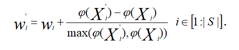

___
# Вопрос 47: Поиск с косяком рыб
___

Алгоритм поиска косяком рыб (Fish School Search, FSS) предложили в 2008 году Фило и Нето.
В алгоритме FSS рыбы плавают в аквариуме (области поиска) в поисках пищи. Вес каждой рыбы формализует ее индивидуальный успех в поиске решения и играет роль ее памяти. Именно наличие веса у агентов популяции является главной особенностью парадигмы FSS. 
Операторы алгоритма FSS объединены в две группы:
- *Оператор кормления*, формализующий успешность исследования агентами тех или иных областей аквариума;
- *Операторы плавания*, реализующие алгоритмы миграции агентов.
	
Оператор кормления (feeding operator). Обозначим Wi, текущий вес агента Si. В алгоритме FSS принято, что вес агента пропорционален нормализованной разности значений фитнесс-функции на следующей и текущей итерациях.

Операторы плавания (swimming operators). В алгоритме FSS различают три вида плавания – *индивидуальное*, *инстинктивно-коллективное* и *коллективно-волевое*. Эти виды плаваний выполняются на интервалах (t, τ], (τ,θ], (θ, t'] основного итерационного интервала (t, t'] соответственно. 

Индивидуальное плавание (individual swimming). Направление перемещения агента в этом случае равновероятно случайно. Если это перемещение выводит агента за пределы области допустимых значений D, то перемещение не выполняем. Аналогично, перемещение агента Si не проводится, если в новой точке Xiτ значение фитнесс-функции не выше ее значения в предыдущей точке Xit;  .
Процесс индивидуального плавания может включать в себя не одно итерацию, как в рассмотренной схеме, а некоторое их фиксированное число. Таким образом, индивидуальное плавание агента можно интерпретировать как локальный поиск в окрестности текущего положения агента.

Инстинктивно-коллективное плавание (collective-instinct swimming) реализуем после завершения всеми агентами индивидуальных плаваний по формуле:

       (2.1)
  
  
  
Второе слагаемое в формуле (2.1) есть ни что иное, как общий для всех агентов шаг миграции, представляющий собой взвешенную сумму индивидуальных перемещений агентов. Формула (2.1) означает, что в процессе инстинктивно-коллективного плавания на каждого из агентов оказывают влияние все остальные агенты популяции, и это влияние пропорционально индивидуальным успехам агентов. 

Коллективно-волевое плавание (collective volition swimming) выполняем вслед за инстинктивно-коллективным плаванием. Коллективно-волевое плавание заключается в смещении всех агентов в направлении текущего центра жесткости популяции, если суммарный вес косяка в результате индивидуального и инстинктивно-коллективного плавания увеличился, и в противоположном направлении – если это вес уменьшился. Другими словами, в случае успешных в среднем указанных плаваний популяции стягивается к своему центру тяжести, т.е. повышает интенсивность поиска. В противном случае популяция расширяется от того же цента, повышая свои диверсификационные свойства.

Известен ряд модифицированных алгоритмов FFS. В качестве примера можно рассмотреть так называемы плотный алгоритм FFS (Density FFS, DFFS), использующий модификацию операторов классического алгоритма, а также новые операторы – так называемые операторы памяти и разбиения.
Оператор памяти (memory operator)строится на основе – векторов памяти Mi, агентов популяции и формализует текущее и ряд предшествующих влияний на каждого данного агента других агентов популяции.
Оператор разбиения (partitioning operator) использует память агентов и предназначен для формирования на основе популяции ряда подпопуляций. 

