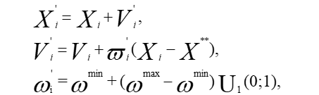
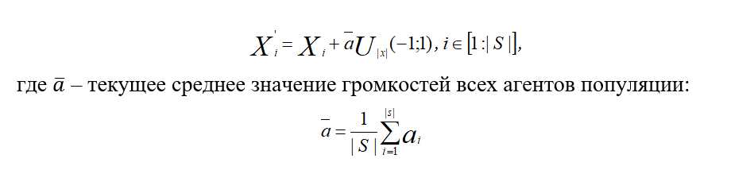

___
# Вопрос 48: Алгоритм, инспирированный летучими мышами
___

Алгоритм, инспирированный летучими мышами (Bat-Inspired, BI), предложен Янгом в 2010 году. Алгоритм может показаться немного сложнее, чем большинство других алгоритмов роевого интеллекта, а также эволюционных алгоритмов, однако он может быть достаточно эффективно применен к проблемам оптимизации и давать хорошие результаты, затрачивая меньшее количество времени.

Большинство видом летучих мышей обладает совершенными средствами эхолокации, которые используются ими для обнаружения добычи и препятствий, а также для обеспечения возможности разместиться в темноте. Для локализации движущихся объектов мыши используют эффект Доплера. 
Алгоритм BI предполагает следующую модель поведения летучих мышей. 
1. С помощью эхолокации все мыши могут измерять расстояние до добычи и препятствий, а также различать их.
2. Мыши движутся случайным образом. Текущие положение и скорость мыши Si равны Xi и V соответственно. Для поиска добычи мыши могут менять частоту этих сигналов, а так ж частоту повторения излучаемых импульсов (rate of pulse) .
3. Частота сигналов может изменяться в диапазоне [ωmin, ωmax], 
ωmin > ωmax ≥ 0, а громкость сигналов -  в пределах от 0 до 1.

Положим, что речь идет о задаче глобальной безусловной минимизации функции. Основные шаги схемы алгоритма BI имеют следующий вид.
- **Инициализация популяции.** Задаем начальные положения агентов Si. 
-  Определяем глобально лучшего агента и соответствующее ему решение X**.
-  **Миграция агентов.** Выполняем перемещение всех агентов на один шаг в соответствии с используемой миграционной процедурой.
-  **Локальный поиск.** С вероятностью ξir (свободный параметр алгоритма) реализуем процедуру локального поиска в окрестности лучшего решения Xi* найденного агентом Si за все предшествующие итерации. Принимаем найденное решение в качестве нового текущего положения агента Si.
-  **Глобальный поиск.** В окрестности текущего решения X, случайным образом генерируем решение X’i. Если φ(X’i)<φ(X**), то с вероятностью ξia принимаем решение X’i в качестве нового текущего положения агента Si. Находим новое глобально лучшее решение X**.
-  Эволюция параметров  ξir , ξia.
-  **Окончание итераций.** Проверяем выполнение условий окончания итераций. Если эти условия выполнены, принимаем в качестве решения текущую точку X** и завершаем вычисления, иначе возвращаемся к шагу 2.

Далее более подробная информация

*Инициализацию* популяции осуществляем путем случайного равномерно распределения агентов Si в рассматриваемой области пространства поиска. На этом же этапе задаем начальные значения частот ωi, громкостей ai и частот повторения импульсов ri, равномерно случайно распределяя их в соответствующих интервалах [ωmin; ωmax], [amin; amax], [0;1].
*Миграция агентов.* Миграцию агента si осуществляем по формулам:
 
 

(1.1)

Другими словами, в соответствии с миграционной процедурой агент перемещается в направлении, определяемом суммой вектора перемещения на предыдущей итерации (слагаемое Vi в формуле (1.1)) и случайным образом возмущенного вектора направления на лучшего агента (Xi – X**).
*Локальный поиск* выполняем по следующей схеме.
	Случайным образом варьируем текущее положение агента Si в соответствии с формулой
 
	Вычисляем значение функции в новой точке. Если оно больше, то завершаем процедуру локального поиска, в противном случае фиксированное число раз возвращаемся к шагу 1.
	
Авторами алгоритма выполнено широкое экспериментальное сравнение эффективности алгоритма BI с генетическим алгоритмом и алгоритмом роя частиц. Показано, что с точки зрения вероятности локализации глобального экстремума алгоритм BI обладает большей эффективностью, чем указанные алгоритмы.

