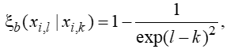

____
# Вопрос 49: Алгоритм растущих деревьев.
____

*Источники: Реферат*

## Общие сведения

Алгоритм растущих деревьев (Saplings Sowing and Growing ир, SSG) предложен Карчи (А . Karci) с соавторами в 2002 г. Алгоритм вдохновлен эволюцией
растущих деревьев и включает в себя два этапа - этап посадки (sowing phase)
и этап роста (growing uр phase).

Задача глобальной условной оптимизации рассматривается в случае, когда область допустимых значений (сад) представляет собой гиперпараллелепипед П. На этапе посадки саженцы (начальные решения) случайным образом равномерно располагаются в области поиска - создаётся равномерный сад (uniform garden). 

Этапы роста реализуются с помощью трех операторов - оператор скрещивания (mating operator), оператор ветвления (branching operator) и оператор прививки (vaccinating operator).

## Схема алгоритма

Шаг 1. Посадка саженцев случайным образом равномерно в области поиска.  

Шаг 2. Скрещивание агентов путём обмена между этими векторами некоторым числом их компонент.  

Шаг 3. Ветвление путём изменения компонент вектора.  

Шаг 4. Оператор прививки применяют к агентам в том случае, когда мера их близости  превышает порог  .   

Шаг 5. После применения к текущей популяции указанных операторов получается промежуточная популяция, которой соответствует объединение исходных  и модифицированных векторов. После вычисления значений фитнес-функции во всех указанных точках из промежуточной популяции отбираются лучшие агенты в количестве равном изначальному количеству агентов в новую популяцию.  

Шаг 6. Если условие окончания алгоритма выполнено, то в качестве результата решения задачи принимается лучшее решение, иначе переход к шагу 2.

## Используемые формулы

Вероятность скрещивания агентов определяем на основе нормированного евклидова расстояния между ними:

r - длина диагонали параллелепипеда П, т. е.:

Линейная формула: 

Нелинейная формула:

Мера близости агентов вычисляется по формуле:

Прививка выполняется по следующим правилам:

