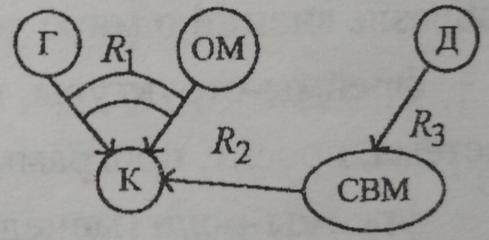
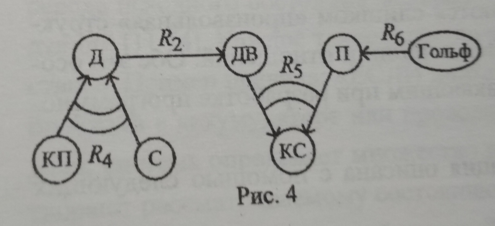
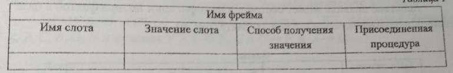

____
# Вопрос 5: Система представления знаний. Фреймы. Семантические сети. Классификация базовых понятий СС.  Сущности и отношения.
____
 
 **ПРИМЕЧАНИЯ**
 ***Я не знаю, что Новакова подразумевает под классификацией базовыз понятий СС.Написала всё, что есть в методе***

 
**Знания** - это закономерности предметной области (принципы, связи, законы), полученные в результате практической деятельности и проффесионального опыта, 
позволяющие спкциалистам ставить и решать задачи в этой области.
Отличительными свойствами знаний являются внутренняя интерпретируемость, структурированность, связность, активность.
Знания основаны на данных, полученных эмпирическим путём. Они представляют результат практической деятельности человека, направленной на обобщениие его опыта, 
полученного в результате практической деятельности.

**Данные** - это отдельные факты, характерезующие объекты, процессы и явления предметной области,а также значения их свойств.

По способам организации знаний и их обрвботки различают следующие основные группы методов представления: логические, продукционные, сетевые, фреймовые.

В основе **сетевых методов** лежит представление знаний в виде множества понятий, связанных семантическими отношениями.
Графически понятия выражаются вершинами сетей, отношения - направленными дугами.

Достоинства:
-наглядное отображение взаимосвязей между объектами базы знаний
-хорошие классификационные свойства сети
-высокая смысловая выразительность сети, что обеспечивает прямое моделирование семантики предметной области и позволяет проектировщику обращаться с системой на уровне понятий профессионально -ориентированного языка
-возможность легко модифицировать представленные данные

Недостатки:
-слишком "произвольная" структура графа
-большое разнообразие типов вершин и отношений

**Пример**

Ситуации описаны фразами: 
1. Дом был построен на самом высоком месте узкой косы между гаванью и открытом морем.
Построен он был прочно, как корабль, и выдержал три урагана.
2. Его защищали от солнца высокие кокосовые пальмы, пригнутые пассатами. а с океанской стороны крутой спуск вел прямо от двери к белому песчаному пляжу, который омывался Гольфстримом.

Ввведём обозначения: Г - гавань, ОМ - открытое море, К - коса, Д - дом, СВМ - самое высокое место, КП - кокосовые пальмы, С - солнце, КС - крутой спуск,
ДВ - дверь, П - пляж, Гольф - Гольстрим.
Введём отношения: R1 - быть между, R2 - принадлежать, R3 - находиться на, R4 - защищать от,R5 - соединять, R6 - омывать.
На картинке стрелки - бинарные отношения, тернарные - стрелки, стянутые дугами.

Последний пример показывает, что семантические сети обладают возможностями отражения любых отношений между понятиями и объектами, и позволяют описывать предложения естественного языка, даже художественную литературу.

**Фреймовое представление знаний** - разновидность сетевых моделей.
Фрейм - информационная структура, описывающая конкретный стандартный фрагмент знаний (объект, ситуацию, процедуру и т.д.).
Традиционно структура фрейма:

Два последних столбца предназначены для описания способа получения слотом его значения и возможного присоединения к тому или иному слоту специальных процедур.
В качестве значения слота может выступать имя другого фрейма. что позволяет формировать сети фреймов.

Модель фрейма является  универсальной,т.к. позволяет отобразить всё многообразие знаний и мире через:
-фреймы - структуры, используемые для обозначения объектов и понятий(система, программа и др)
-фреймы - сценарии (празднование др, проведение соревнований и др)
-фреймы - ситуации (тревога, авария и др)

Достоинства:
- структурированность информации по сравнению с семантическими сетями
- более компактное представление о конкретных фактах, ситуациях и т.д.
- возможность описывать в рамках одного фрейма одновременно как декларативные(константно заданные), так процедурные(те, которые можно получить с помощью процедур).

**СУЩНОСТИ И ОТНОШЕНИЯ**

Существует конечное множество базовых отношений между информационными единицами и объектами реального мира, используя комбинацию которых можно выразить необходимые отношения.

**Отношением** называется взаимосвязь  или взаимодействие двух и более объектов лтбо явлений абстрактного или конкретного типа. 

**Теоретико - множественные отношения** позволяют сформировать классы понятий. а также упорядочить понятия в рамках этих классов.
Этот вид взаимосвязей представляется отношениями "род - вид" и "часть - целое", которые используются для построения рабочей модели организации знаний, выражая свойство вложенности(наследственности) понятий.

**Характеристические отношения** "иметь свойство" и "иметь состояние" дают возможность описать объекты предметной области  и процессы путём выделения наиболее существенных их характеристие и установить таким образом зависимости между объектами и свойствами, процессами и состояниями.

**Казуальные отношения** лежат в основе построения формальных логических рассуждений, которые могут использоваться для формирования маршрута проектирования, прогнозирования, анализа проектных решений и т.д.
Отношения "причина - следствие"  связывают факты, между которыми существует причинно - следственная зависимость. 
Отношения "влиять на"  не отражают существование причинно - следственных зависимостей и определяют вероятность следствия при наличии причины. Этот вид казуальных отношений носит нечёткий характер и отражает неполноту знаний проектировщика.

**Инструментальные отношения** "выполняться посредством" связывают процессы и реализующие их процедуры.

**Квантифицирующие отношения** позволяют установить соответствие между свойствами и их значениями.
Представляются как "иметь числовое( или лингвистическое) значение" 

**Временные отношения** отражают относительное протекание процессов во времени.
Они имеют вид "быть раньше", "быть позже", "быть одновременно" и дают возможность построения рабочих моделей, определяющих последовательности процессов в ходе проектирования.

**Пространственные отношения** характерезуют пространственное расположение объектов и определяют абсолютное расстояние между ними.
Отношения "расстояние между" или "быть расположенным"

**Арифмитические отношения** используются для построения вычислительных моделей для определения значений свойств.

**Логические отношения**  служат связками при описании всех указанных функций и в этом смысле являются универсальными.