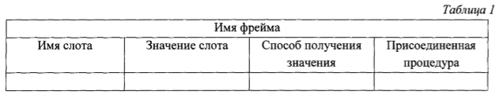
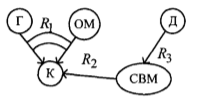
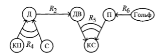

____
# Вопрос 5: Система представления знаний. Фреймы. Семантические сети. Классификация базовых понятий СС.  Сущности и отношения.
____
  
## Система представления знаний

(Написал здесь про представление знаний)

**Знания** - это закономерности предметной области (принципы, связи, законы), полученные в результате практической деятельности и проффесионального опыта, 
позволяющие спкциалистам ставить и решать задачи в этой области.
Отличительными свойствами знаний являются внутренняя интерпретируемость, структурированность, связность, активность.
Знания основаны на данных, полученных эмпирическим путём. Они представляют результат практической деятельности человека, направленной на обобщениие его опыта, 
полученного в результате практической деятельности.

**Данные** - это отдельные факты, характерезующие объекты, процессы и явления предметной области,а также значения их свойств.

Как показывают исследования ряда естественных языков и различных
предметных областей, существует конечное множество базовых отношений между информационными единицами и объектами реального мира, используя комбинации которых можно выразить необходимые отношения. Отношением называется взаимозависимость или взаимодействие двух или более объектов либо явлений абстрактного или конкретного типа. (виды отношений рассмотрены в [вопросе 2](2.md))

Первым этапом разработки смысловой модели является выбор метода
представления инженерных знаний, который определяет форму описания
фактов и закономерностей предметной области. По способам организации знаний и их обработки различают следующие основные группы методов представления: логические, продукционные, сетевые, фреймовые.

##  Фреймы

Разновидностью сетевых моделей является фреймовое представление знаний. Термин «фрейм» (от англ, frame, что означает «каркас», «структура», «рамка») был предложен Марвином Минским для обозначения структуры знаний для восприятия пространственных сцен. Фрейм представляет собой информационную структуру, описывающую конкретный стандартный фрагмент знаний (объект, ситуацию, процедуру и т. п.). Эта модель, как и семантическая сеть, имеет глубокое психологическое обоснование. В психологии и философии известно понятие абстрактного образа. Например, произнесение вслух слова «комната» порождает у слушающих образ комнаты: «жилое помещение с четырьмя стенами, полом, потолком, окнами и дверью, площадью 10-20 $$ m^2 $$».  Из этого описания ничего нельзя убрать (например, убрав окна, мы получаем чулан или кладовку, а не комнату). В определении фрейма есть «дырки», или «слоты», - это незаполненные значения некоторых атрибутов, например количество окон и дверей, цвет стен, высота потолка, покрытие пола и др. В теории фреймов такой образ комнаты называется фреймом комнаты. Фреймом также называется и формализованная модель для отображения образа. 

Различают фреймы-образцы, или прототипы, хранящиеся в базе знаний, и фреймы-экземпляры, которые создаются для отображения реальных фактических ситуаций на основе поступающих данных. Модель фрейма является достаточно универсальной, поскольку позволяет отобразить все многообразие знаний о мире через:

* фреймы-структуры, используемые для обозначения объектов и понятий (система, проект, программа);
* фреймы-роли (менеджер, разработчик, проектировщик, конструктор);
* фреймы-сценарии (празднование дня рождения, заседание ученого совета, проведение соревнований); 
* фреймы-ситуации (тревога, авария, рабочий режим устройства) и др. 

Традиционно структура фрейма может быть представлена как список свойств (табл. 1). В таблице два последних столбца предназначены для описания способа получения слотом его значения и возможного присоединения к тому или иному слоту специальных процедур. В качестве значения слота может выступать имя другого фрейма, что позволяет формировать сети фреймов.

Достоинством представления инженерных знаний в виде системы фреймов является структурированность информации по сравнению с семантическими сетями, более компактное представление о конкретных фактах, ситуациях и т. п., возможность описывать в рамках одного фрейма одновременно как декларативные, так и процедурные знания.

## Семантические сети

В основе сетевых методов лежит представление знаний в виде множества понятий, связанных семантическими отношениями. Графически понятия выражаются вершинами сети, отношения - направленными дугами. Использование семантических сетей в качестве модели представления знаний дает следующие преимущества:
- наглядное отображение взаимосвязей между объектами базы знаний; 
- хорошие классификационные свойства сети; 
- высокая смысловая выразительность сети, что обеспечивает прямое моделирование семантики предметной области и позволяет проектировщику обращаться с системой на уровне понятий профессионально-ориентированного языка; 
- возможность легко модифицировать представленные данные. 

Наряду с преимуществами семантические сети обладают и рядом недостатков, основными из которых являются слишком «произвольная» структура графа и большое разнообразие типов вершин и отношений. Обе эти особенности приводят к сложностям, возникающим при разработке программного обеспечения.

Основным представлением для семантической сети является граф. Однако не стоит забывать, что за графическим изображением непременно стоит строгая математическая запись и что обе эти формы отображают одно и то же. 

### Графическое представление

Основной формой представления семантической сети является граф. Понятия семантической сети записываются в овалах или прямоугольниках и соединяются стрелками с подписями — дугами. Это наиболее удобно воспринимаемая человеком форма. Её недостатки проявляются, когда мы начинаем строить более сложные сети или пытаемся учесть особенности естественного языка. Схемы семантических сетей, на которых указаны направления навигационных отношений, называют картами знаний, а их совокупность, позволяющая охватить большие участки семантической сети, атласом знания. 

### Математическая запись

В математике граф представляется множеством вершин V и множеством отношений между ними E. Используя аппарат математической логики, приходим к выводу, что каждая вершина соответствует элементу предметного множества, а дуга — предикату. 

### Лингвистическая запись

В лингвистике отношения фиксируются в словарях и в тезаурусах. В словарях в определениях через род и видовое отличие родовое понятие занимает определённое место. В тезаурусах в статье каждого термина могут быть указаны все возможные его связи с другими родственными по теме терминами. От таких тезаурусов необходимо отличать тезаурусы информационно - поисковые с перечнями ключевых слов в статьях, которые предназначены для работы дескрипторных поисковых систем. 

### Классификация семантических сетей

* По количеству типов отношений, сети могут быть однородными и неоднородными. 
  * Однородные сети обладают только одним типом отношений (стрелок).
  * В неоднородных сетях количество типов отношений больше одного. Неоднородные сети можно представлять как переплетение древовидных многослойных структур. Примером такой сети может быть Семантическая сеть Википедии.  
* По арности: 
  * типичными являются сети с бинарными отношениями (связывающими ровно два понятия). Бинарные отношения очень просты и удобно изображаются на графе в виде стрелки между двух концептов. Кроме того, они играют исключительную роль в математике.
  * На практике, однако, могут понадобиться отношения, связывающие более двух объектов — N-арные. При этом возникает сложность — как изобразить подобную связь на графе, чтобы не запутаться. Концептуальные графы (см. ниже) снимают это затруднение, представляя каждое отношение в виде отдельного узла.
* По размеру: 
  * Для решения конкретных задач, например, тех которые решают системы искусственного интеллекта.
  * Семантическая сеть отраслевого масштаба должна служить базой для создания конкретных систем, не претендуя на всеобщее значение.
  *Глобальная семантическая сеть. Теоретически такая сеть должна существовать, поскольку всё в мире взаимосвязано. Возможно когда-нибудь такой сетью станет Всемирная паутина.

### Пример

Рассмотрим пример. Пусть ситуация описана с помощью следующих предложений: 
1. Дом был построен на самом высоком месте узкой косы между гаванью и открытым морем. Построен он был прочно, как корабль, и выдержал три урагана. 
2. Его защищали от солнца высокие кокосовые пальмы, пригнутые пассатами, а с океанской стороны крутой спуск вел прямо от двери к белому песчаному пляжу, который омывался Гольфстримом. 

Введем обозначение понятий: Д - дом, К - коса, Г - гавань, СВМ - самое высокое место, ОМ - открытое море, КП - кокосовые пальмы, С - солнце, КС - крутой спуск, ДВ - дверь, П - пляж, Гольф - Гольфстрим. 

Введем отношения: $$ R_1 $$ - быть между, $$ R_2 $$ - принадлежать, $$ R_3 $$ - находиться на, $$ R_4 $$ - защищать от, $$ R_5 $$ - соединять, $$ R_6 $$ - омывать. На первом рисунке ниже представлена семантическая сеть, описывающая первую фразу, а на другом рисунке - вторую. 

  

  

Бинарные отношения показаны обычными стрелками, а тернарные - стрелками, стянутыми дугами. Последний пример показывает, что семантические сети обладают возможностями отражения любых отношений между понятиями и объектами, и позволяют описывать предложения естественного языка, даже художественную литературу. Однако и они обладают недостатками: семантические сети имеют слишком «произвольную» структуру и большое разнообразие типов вершин и отношений, что приводит к сложностям в разработке обрабатывающих их программ.

## СУЩНОСТИ И ОТНОШЕНИЯ

Некоторые определения сущностей (из Интернета):

- Сущность — совокупность таких свойств предмета, без которых он неспособен существовать и которые определяют все остальные его свойства.

- Сущность — смысл данной вещи, то, что она есть сама по себе, в отличие от всех других вещей и в отличие от изменчивых (под влиянием тех или иных обстоятельств) состояний вещи.

- Сущность (в базах данных) – это реальный или представляемый тип объекта, информация о котором должна сохраняться и быть доступна.

Существует конечное множество базовых отношений между информационными единицами и объектами реального мира, используя комбинацию которых можно выразить необходимые отношения.

**Отношением** называется взаимосвязь  или взаимодействие двух и более объектов лтбо явлений абстрактного или конкретного типа. 

**Теоретико - множественные отношения** позволяют сформировать классы понятий. а также упорядочить понятия в рамках этих классов.
Этот вид взаимосвязей представляется отношениями "род - вид" и "часть - целое", которые используются для построения рабочей модели организации знаний, выражая свойство вложенности(наследственности) понятий.

**Характеристические отношения** "иметь свойство" и "иметь состояние" дают возможность описать объекты предметной области  и процессы путём выделения наиболее существенных их характеристие и установить таким образом зависимости между объектами и свойствами, процессами и состояниями.

**Казуальные отношения** лежат в основе построения формальных логических рассуждений, которые могут использоваться для формирования маршрута проектирования, прогнозирования, анализа проектных решений и т.д.
Отношения "причина - следствие"  связывают факты, между которыми существует причинно - следственная зависимость. 
Отношения "влиять на"  не отражают существование причинно - следственных зависимостей и определяют вероятность следствия при наличии причины. Этот вид казуальных отношений носит нечёткий характер и отражает неполноту знаний проектировщика.

**Инструментальные отношения** "выполняться посредством" связывают процессы и реализующие их процедуры.

**Квантифицирующие отношения** позволяют установить соответствие между свойствами и их значениями.
Представляются как "иметь числовое( или лингвистическое) значение" 

**Временные отношения** отражают относительное протекание процессов во времени.
Они имеют вид "быть раньше", "быть позже", "быть одновременно" и дают возможность построения рабочих моделей, определяющих последовательности процессов в ходе проектирования.

**Пространственные отношения** характерезуют пространственное расположение объектов и определяют абсолютное расстояние между ними.
Отношения "расстояние между" или "быть расположенным"

**Арифмитические отношения** используются для построения вычислительных моделей для определения значений свойств.

**Логические отношения**  служат связками при описании всех указанных функций и в этом смысле являются универсальными.