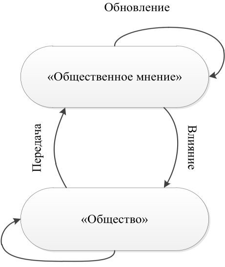
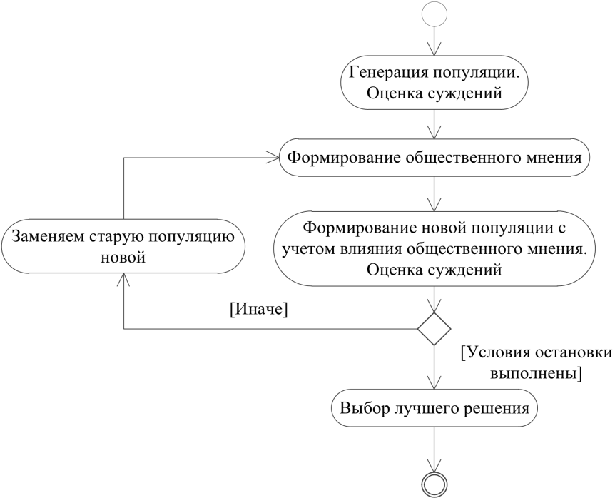
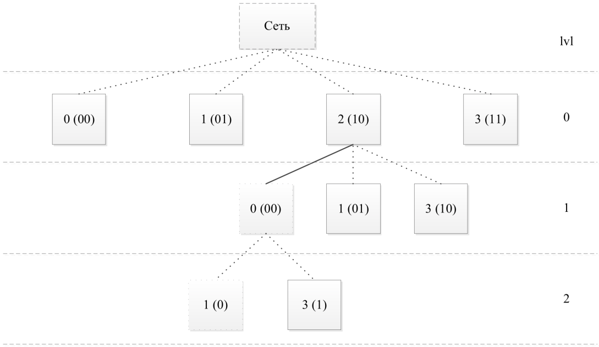
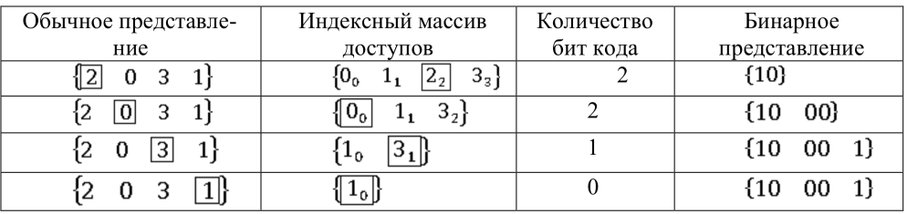
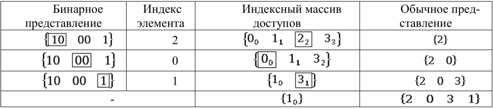

# Вопрос 51: Алгоритм культурного обмена

Общие сведения. Алгоритм культурного обмена, или культурный алгоритм (Cultural Algorithm, CA), является одним из направлений искусственного интеллекта, который основан на моделировании и использовании эволюционных процессов общественных структур. Он представляет собой совокупность двух пространств, взаимодействие между которыми определяется соответствующим протоколом или набором правил (рис. 1).

Рис 1. Набор правил

Первое пространство – это «общество», второе – «общественное мнение». Компонента «общество» состоит из индивидуумов, каждый из которых обладает собственным видением решения проблемы в исследуемой сфере. Лучшие (по установленным критериям) из таких суждений, за период существования поколения общества, формируют компоненту «Общественное мнение». Протокол (передача-влияние), в свою очередь, определяет меняющуюся с течением времени зависимость одного компонента от другого: обновление пространства мнений при появлении новых поколений и влияние полученных текущих решений на генерацию новых. Описание работы алгоритма представлено с помощью диаграммы деятельности UML (рис. 2).

Рис 2. Диаграмма деятельности

Рассмотрим применение данного алгоритма для решения задачи топологической оптимизации компьютерной сети. Согласно концепции алгоритма ключевым элементом моделируемой системы являются представители популяции. Множество представителей формируют общество. У каждого из них есть собственное представление об исследуемой области (суждение). Для задачи топологической оптимизации оно может быть представлено следующим выражением: {2031}. Данная запись задаёт предполагаемую последовательность соединения объектов сети в оптимальную топологию. Для упрощения представления пространства представим топологию сети в виде бинарного дерева (рис. 3). Древовидное представление топологии имеет n - 1 уровней, где n – это число узлов в оптимизируемой сети. Размер слова зависит от номера уровня lvl в иерархии и величины сети. Количество бит в слове определяется степенью двойки, ближайшей сверху к значению выражения n - lvl .

Рис 3. Топология сети в виде бинарного дерева

Шифрование проводится с помощью двух списков. Первый – последовательность узлов в топологии, второй – упорядоченный индексный список доступных для использования узлов. Для каждого числа в последовательном списке ищется соответствие в индексном. Затем найденный таким образом индекс переводится в двоичное слово с длиной, определённой параметрами дерева. Далее задействованный элемент индексного списка удаляется. Процесс будет длиться до тех пор, пока в списке доступных узлов не останется один элемент. Его включение в топологию предопределяют ранее задействованные узлы.

При дешифровке каждое слово бинарного представления переводится в десятичное представление, получают позицию искомого узла в индексном массиве. Номер найденного узла попадает в список обычного представления и удаляется из
индексного списка. Когда все двоичные слова обработаны надлежащим образом, в индексном массиве остается одно значение, которое добавляется в результирующий список (как и в случае шифрования, его значение предопределено предыдущими включениями). Пример последовательности действий шифрования обычного представления и дешифровки бинарного приведены в табл. 1 и 2 соответственно. Преобразование представлений обратимо и единственно.

Таблица 1

Таблица 2

Двоичное представление позволяет упростить процедуры генерации нового поколения. За счёт свойств древовидного представления изменение хромосомы в одном месте влечёт за собой её полную рекомбинацию. При этом дополнительных действий и проверок не требуется. Обычное же представление имеет преимущество в ходе оценки предлагаемых решений и формировании конечного результата.
