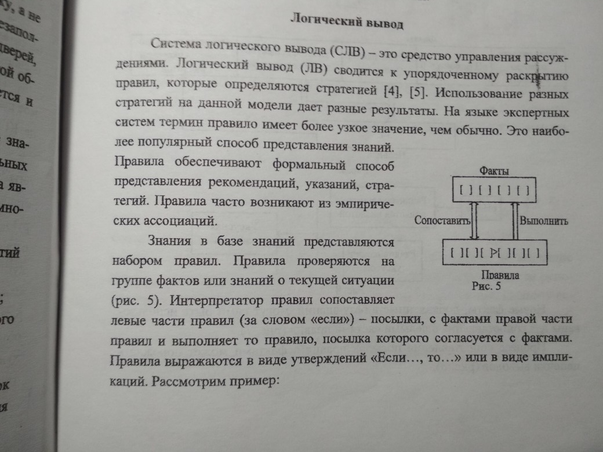
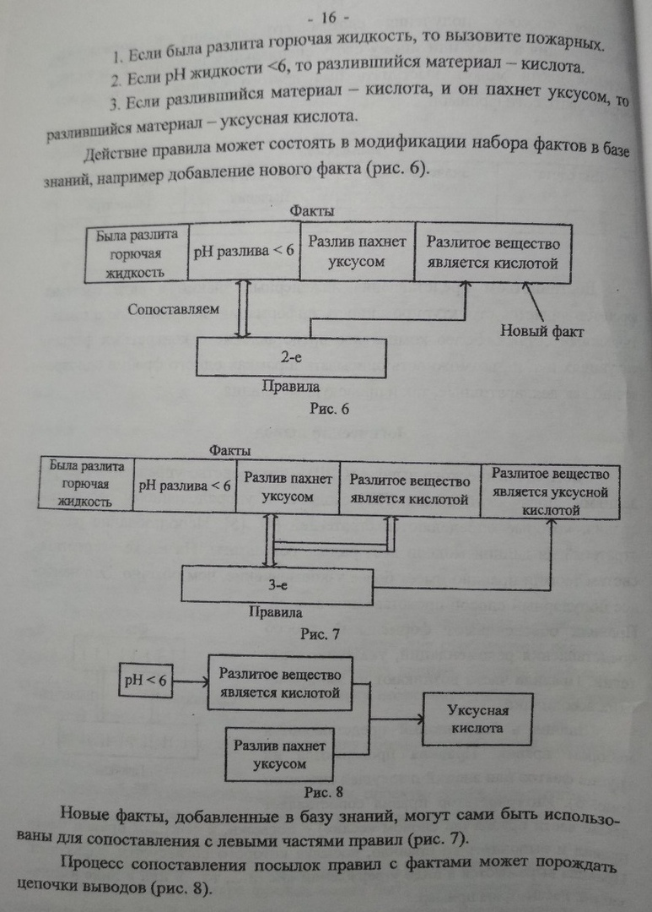
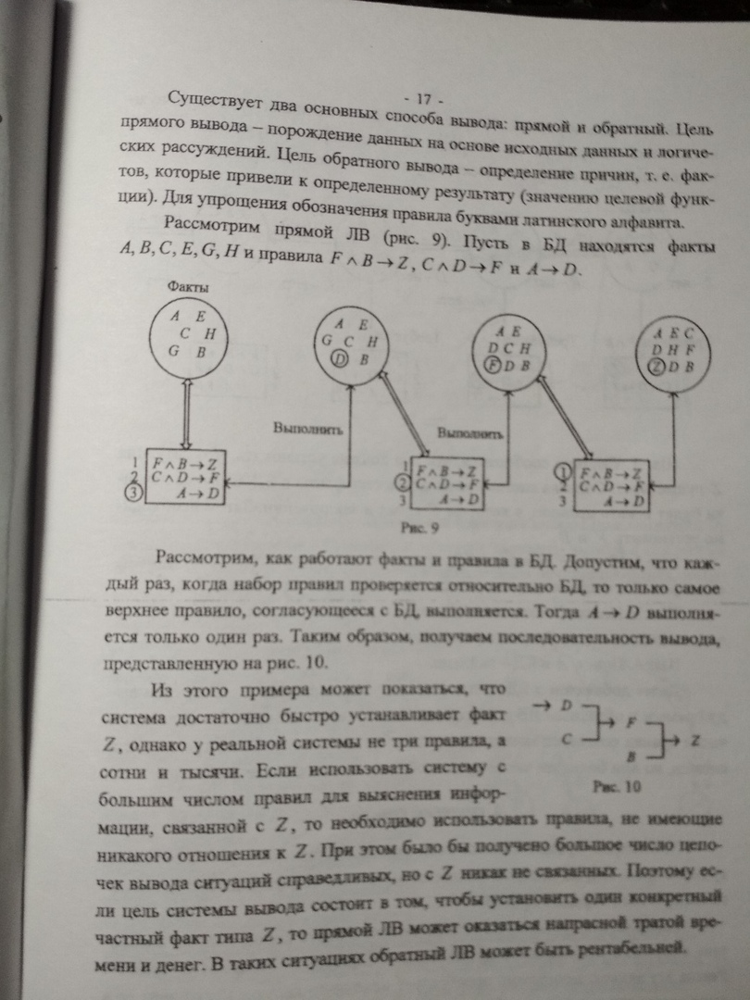
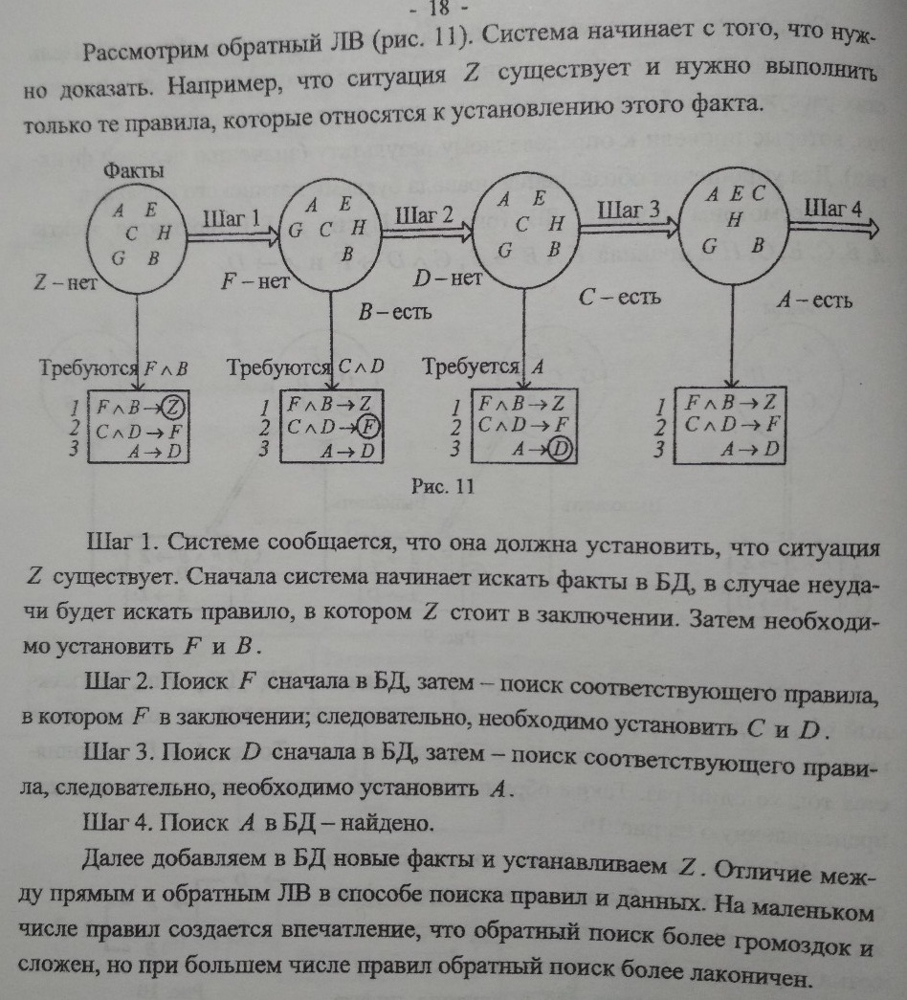

____
# Вопрос 6: Логическая модель представления знаний. Декларативное и процедурное представление знаний. Система логического вывода (СЛВ)
____
 
**Знания** - это закономерности предметной области (принципы, связи, законы), полученные в результате практической деятельности и проффесионального опыта, 
позволяющие спкциалистам ставить и решать задачи в этой области.
Отличительными свойствами знаний являются внутренняя интерпретируемость, структурированность, связность, активность.
Знания основаны на данных, полученных эмпирическим путём. Они представляют результат практической деятельности человека, направленной на обобщениие его опыта, 
полученного в результате практической деятельности.

**Данные** - это отдельные факты, характерезующие объекты, процессы и явления предметной области,а также значения их свойств.

**ЛОГИЧЕСКИЕ МЕТОДЫ** представления знаний базируются на использовании понятия формальной системы, задаваемой множеством синтаксических правил, 
позволяющих строить из базовых элементов синтаксически правильные выражения, множество аксиом,множество семантических правил вывода, позволяющих расширять множество аксиом за счёт других выражений.
Наибольшее распространения в рамках этого подхода получило исчисление предикатов.

Логические методы представления знаний обеспечивают единственность теоретического обоснования системы формально точных определений и выводов, простоту и ясность
нотации для записи фактов, которая обладает чётко определений семантикой и простотой понимания.
В то же время основным недостатком логических методов является отсутствие чётких принципов организации фактов в базе знаний, что затрудняет её анализ и обработку.
Это приводит к тому, что логические методы используются в основном в тех предметных областях, где система знаний невелика по объёму и имеет однородную структуру.

***понятно о деклвративном и процедурном:***

Процедурная информация овеществлена в программах, которые выполняются в процессе решения задач, декларативная – в данных с которыми эти программы работают.

***длинно о деклвративном и процедурном:***

**ПРОЦЕДУРНОЕ ПРЕДСТАВЛЕНИЕ** основано на предпосылке, что интеллектуальная деятельность есть знание проблемной среды, вложенное в програм­мы, то есть знание о том, как можно использовать те или иные сущности.

**ДЕКЛАРАТИВНОЕ ПРЕДСТАВЛЕНИЕ** основано на предпосылке, что знание неких сущностей «знать, что?» не имеет глубоких связей с процедурами, исполь­зуемыми для обработки этих сущностей.
При использовании ДП счи­тается, что интеллектуальность базируется на некотором универсаль­ном множестве процедур, обрабатывающих факты любого типа, и на множестве специфических фактов, описывающих частную область знаний.

Основное достоинство ДП по сравнению с ПП заключается в том, что в ДП нет необходимости указывать способ использования конкретных фрагментов знания.
Простые утверждения могут использоваться несколькими способами, и может оказаться неудобным фиксировать эти способы заранее.
Указанное свойство обеспечивает гибкость и экономичность ДП, так как позволяет по-разному использовать одни и те же факты.
В ДП знание рассматривается как множество незави-симых или слабо зависимых фактов, что позволяет осуществлять модификацию знаний и обучение простым добавлением или устранением утверждений.
Для ПП проблема модификации значительно сложнее, так как здесь необходимо учитывать, каким образом используется данное утверждение.

