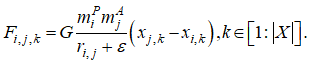
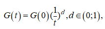
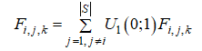
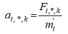
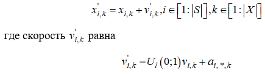
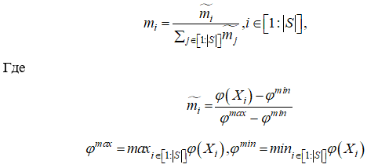
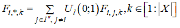

____
# Вопрос 40: Гравитационный поиск.
____

*Источники: билеты по ОИИ*

*В этом вопросе нижние индексы обозначаются через нижнее подчёркивание, потому что по-другому очень долго, верхние - через степень. 
Пример: m i-тое это: m_i, m с верхним индексом i это m^i*

**Общее**  
Алгоритмы, вдохновлённые физическими явлениями, характерны тем, что опираются на законы физики. 
Примеры алгоритмов: алгоритм имитации отжига, гармонический поиск, алгоритм оптимизации центральной силой.

**Гравитационный поиск**

Алгоритм гравитационного поиска является развитием детерминированного алгоритма глобального многомерного поиска, получившего название алгоритма оптимизации центральной силой. 
Алгоритм гравитационного поиска является стохастическим, начальное распределение носит случайный характер; гравитационная постоянная изменяется в процессе поиска по некоторым правилам.
Алгоритм использует аналогию движения тяжелых тел вследствие их гравитационного взаимодействия.

**На каждой итерции**

Алгоритм гравитационного поиска использует следующее правило вычисления силы, действующей на массу m_i со стороны массы m_j по k-му измерению:

Здесь eps - малая константа, r_i,j - текущее евклидово расстояние между массами m_i и m_j. Гравитационную постоянную G уменьшаем с ростом числа итераций по правилу:

где G(0) – её начальное значение, а d - свободный параметр алгоритма.
Суммарную силу F_i,j,k действующую на зонд s_i по k-му измерению, полагают случайной величиной, равной

Ускорение указанного зонда по тому же измерению находим по формуле

Если положение зонда s_i по k-му измерению на данной итерации есть x_i,k , то на следующей итерации его определяет выражение

Простейший алгоритм гравитационного поиска предполагает равенство активной, пассивной и инертной масс m^A, m^P, m^l   точнее говоря, полагается, что

**(я считпю, что это критерий останова)**

Эффективность поиска с помощью алгоритма гравитационного поиска может быть повышена, если с ростом числа итераций сокращать по некоторому правилу в формуле число зондов, оставляя лишь наиболее массивные из них.
Тем самым можно обеспечить лучший компромисс между диверсификацией поиска на начальных итерациях и его интенсификацией на завершающих итерациях.
Обозначим S'' текущий набор лучших (самых тяжелых) зондов, а I'' -
совокупность номеров этих зондов. Тогда модифицированная формула примет вид

Число |S’’| лучших зондов с ростом числа итераций уменьшают, например, по линеqному закону, так что, в конце концов, остается лишь один зонд, притягивающий остальные зонды.