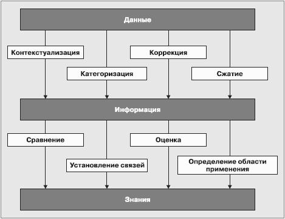
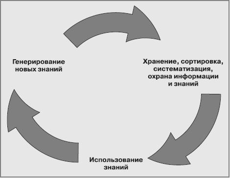

____
# Вопрос 8: Данные и знания. Управление знаниями.
____

## Данные и знания

**Данные** – это совокупность различных объективных фактов.

**Информация** – это иерархическая совокупность данных о тех или иных аспектах реального мира.

**Информация** – это поток сообщений, из которого создается знание.

Информация имеет получателя и отправителя. Она информирует, т. е. «придает форму» получателю путем изменения его оценок или поведения. Именно получатель оценивает, информирует ли его сообщение или оно представляет собой информационный шум.

Данные превращаются в информацию следующими путями:
- контекстуализация – мы знаем, для чего эти данные нужны;
- категоризация – мы разбиваем данные на типы и компоненты;
- подсчет – мы обрабатываем данные математически;
- коррекция – мы исправляем ошибки и ликвидируем пропуски;
- сжатие – мы сжимаем, концентрируем, агрегируем данные.

**Знания** – понятие более глубокое и широкое, чем просто данные или информация. Обычно мы говорим о знающем человеке, подразумевая не только обладание информацией, но и мудрость, опыт, образование, способность проникать в суть предмета. Мы не относим понятие «знание» к документу, книге или базе данных, даже если они есть продукт труда знающего человека или группы знающих людей.

**Знания**, как правило, содержат общие сведения относительно структур, процессов и явлений. В то же время знания не только располагаются на более высокой ступени обобщения, чем данные. Знания играют роль структур, обеспечивающих организацию данных. Так, сведения о персонале организации – всего лишь данные. Но модель представления сведений о каждом работнике, которая включает в себя его идентификационный номер, данные паспорта, данные об образовании, карьерный рост в организации и пр., – это определенные знания.

## Управление знаниями

Управление знаниями в организации – это систематический процесс идентификации, использования и передачи информации, знаний, которые люди могут создавать, совершенствовать и применять. Это процесс, в ходе которого организация генерирует знания, накапливает их и использует в интересах получения конкурентных преимуществ.

Управление знаниями включает в себя следующие компоненты:
- стимулирование прироста знаний;
- отбор и аккумулирование значимых сведений из внешних по отношению к данной организации источников;
- сохранение, классификацию, трансформацию, обеспечение доступности знаний;
- распространение и обмен знаний, в том числе в рамках организации;
- использование знаний в деловых процессах, в том числе при принятии решений;
- воплощение знаний в продуктах, услугах, документах, базах данных и программном обеспечении;
- оценку знаний, измерение и использование НМА организации;
- защиту знаний.

**Управление знаниями** – это комбинация отдельных аспектов управления персоналом, инновационного и коммуникационного менеджмента, а также использования новых информационных технологий в управлении организациями.

**Управление знаниями** – не автономная, не самостоятельная активность, а неотъемлемая часть менеджмента любой организации.

