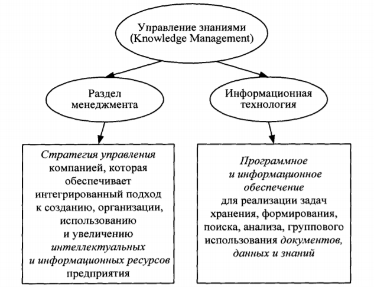

____
# Вопрос 8: Данные и знания. Управление знаниями.
____

## Данные и знания

Данные - это отдельные факты, характеризующие объекты, процессы и явления предметной области, а также значения их свойств. 
При обработке в информационных системах данные меняются, проходя несколько этапов преобразований: от результатов измерений и наблюдений до баз данных на машинных носителях информации. Знания основаны на данных, полученных эмпирическим путем. Они представляют собой результат мыслительной деятельности
человека, направленной на обобщение его опыта, полученного в результате практической деятельности . 

Знания - это закономерности предметн ой области (принципы, связи, законы), полученные в результате практической деятельности и профессионального опыта, позволяющие специалистам ставить и
решать задачи в этой области. Отличительными свойствами знаний являются внутренняя интерпретируемость , структурированность, связность, активность.

Свойства знаний:

1. Внутренняя интерпретируемость: каждая информационная единица должна иметь уникальное имя, по которому ИС находит ее, а также отвечает на запросы, в которых это имя упомянуто.

2. Структурированность: информационные единицы должны обладать гибкой структурой. Для них должен выполняться "принцип матрешки", т.е. рекурсивная вложимость одних информационных единиц в другие.

3. Связность: в информационной базе между информационными единицами должна быть предусмотрена возможность установления связей различного типа.

4. Активность: знаниям человека свойственна познавательная активность (обнаружение противоречий, неполнота знаний).
В отличие от данных, знания позволяют получать новые знания. 

Часть знаний представлена в явном виде, т. е. они зафиксированы в печатных источниках - книгах, статьях, руководствах, нормативных материалах, содержатся в электронных системах хранения информации и т. п. Это так называемые явные (эксплицитные) знания. Другая часть знаний находится в головах людей и представляет собой опыт и экспертные знания специалиста, которые могут быть потеряны для организации с его уходом . Это - неявные (имплицитные) знания. 

## Управление знаниями

Концепция управления знаниями (УЗ) действи тель но помогает поменять взгляд на авто матизацию корпорации, так как акцент в ней ставится на
ценность информа ции. Новизна конц епци и У З заключается в принципиально
новой цели - копи ть не разрозненную информацию, а знания, т. е. закономерности и принципы, позволяю щие решать реальные бизнес-задачи. При
этом в расчет берутся и те знания, которые «нев идимы» - они хранятся в памяти специали стов, а не на материальных носителях.  

Понятие «управление знаниями» появилось в середине 90-х гг. в крупных
корпорациях, где проблемы обработки информации приобрели особую остроту
и стали критическими. При этом стало очевидным, что основным узким местом
является обраб отка знаний, накопленных специалистами компании, так как
именно эти знания обеспечивают преимущество перед конкурентами. Часто
информации в компаниях накоплено даже больше, чем есть возможность обработать. Различные компании пытаются решить эту проблему по-разному, но
при этом каждая стреми тся увеличить эффективность обработки знаний.

Существует мно жество трактово к термин а Knowledge Management.
Управление знаниями - это установленный в организации формальный порядок работы с инф ормационными ресу рсам и для облегче ния доступа к знаниям и совм естн ого их использования с помощью современных инфо рмац ионных технологий. Основная цель КМ - сделать знания доступными и совместно используемым и на уров не всего пред приятия . В последние годы
управление знаниями все чаще трактует ся как меж дисц иплинар ное научное направление, целью которого является оптимизация использования интеллектуальных и информационных ресурсов, доступных предприятию, для повышения его эффективности.

УЗ можно рассматривать и как новое направление в менеджменте, и
как направление в информатике для поддержки процессов создания, распространения, обработки и использования знаний внутри предприятия (рис. 1).
Ресурсы знаний различаются в зависимости от отраслей индустрии и приложений, но в любой области полезные сведения содержатся в письмах, руководствах, сведениях о партнерах, заказчиках и конкурентах. Данные могут
быть рассредоточены по всему предприятию. Традиционно проектировщики
систем УЗ (СУЗ) ориентировались лишь на отдельные группы потребителей - главным образом, менеджеров. В рамках этого направления КМ называют не только собственно знания, но и данные. Современные СУЗ спроектированы уже в расчете на целую организацию.

Из-за разнообразия задач автоматизации СУЗ вынуждены интегрировать разнообразные технологии:

- электронную почту и Интернет-ресурсы;
- системы управления базами данных (СУБД) и базы данных (БД);
- средства создания хранилищ данных (Data Warehousing);
- системы поддержки групповой (коллективной) работы и управления проектами;
- локальные корпоративные сети и внутрикорпоративные Webсайты;
- системы документооборота и worlflow;
- экспертные системы и базы знаний (БЗ) и др.

При этом ни одна из этих технологий, кроме последней, не включает
«знания» в контексте интеллектуальных систем, т. е. БЗ. Фактически в такой
трактовке УЗ - это модный лозунг в менеджменте и его связь с инженерией
знаний (knowledge engineering) в настоящее время практически эфемерна.
Нечеткость в понимании разработчиками систем автоматизации понятий
«информация», «данные» и «знания» приводит к путанице в терминологии.
Если трактовать информацию как общий термин для всех информационных
ресурсов предприятия, то в реальности современные СУЗ занимаются проблемой организации только части информации, в основном - документооборота в компании.

