____
# Вопрос 41: Алгоритмы, вдохновлённые физическими явлениями. Гравитационный поиск.Электромагнитный поиск.
____
(С гравитационным поиском совсем плохо, потому что просто шаги алгоритма я не смогла найти,но Новакова вроде сама не шарит, потому что её всё устроило)
(В этом вопросе нижние индексы обозначаются через нижнее подчёркивание, потому что по-другому очень долго, верхние - через степень. 
Пример: m i-тое это: m_i, m с верхним индексом i это m^i)

**Общее**
Алгоритмы, вдохновлённые физическими явлениями, характерны тем, что опираются на законы физики. 
Примеры алгоритмов: алгоритм имитации отжига, гармонический поиск, алгоритм оптимизации центральной силой.

**Гравитационный поиск**

Алгоритм гравитационного поиска является развитием детерминированного алгоритма глобального многомерного поиска, получившего название алгоритма оптимизации центральной силой. 
Алгоритм гравитационного поиска является стохастическим, начальное распределение носит случайный характер; гравитационная постоянная изменяется в процессе поиска по некоторым правилам.
Алгоритм использует аналогию движения тяжелых тел вследствие их гравитационного взаимодействия.

**На каждой итерции**

Алгоритм гравитационного поиска использует следующее правило вычисления силы, действующей на массу m_i со стороны массы m_j по k-му измерению:

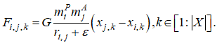

Здесь eps - малая константа, r_i,j - текущее евклидово расстояние между массами m_i и m_j. Гравитационную постоянную G уменьшаем с ростом числа итераций по правилу:

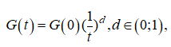

где G(0) – её начальное значение, а d - свободный параметр алгоритма.
Суммарную силу F_i,j,k действующую на зонд s_i по k-му измерению, полагают случайной величиной, равной

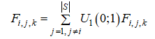

Ускорение указанного зонда по тому же измерению находим по формуле

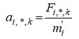

Если положение зонда s_i по k-му измерению на данной итерации есть x_i,k , то на следующей итерации его определяет выражение

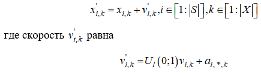

Простейший алгоритм гравитационного поиска предполагает равенство активной, пассивной и инертной масс m^A, m^P, m^l   точнее говоря, полагается, что

**(я считпю, что это критерий останова)**

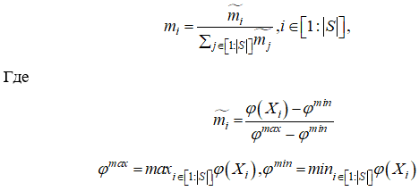

Эффективность поиска с помощью алгоритма гравитационного поиска может быть повышена, если с ростом числа итераций сокращать по некоторому правилу в формуле число зондов, оставляя лишь наиболее массивные из них.
Тем самым можно обеспечить лучший компромисс между диверсификацией поиска на начальных итерациях и его интенсификацией на завершающих итерациях.
Обозначим S'' текущий набор лучших (самых тяжелых) зондов, а I'' -
совокупность номеров этих зондов. Тогда модифицированная формула примет вид

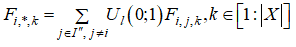

Число |S’’| лучших зондов с ростом числа итераций уменьшают, например, по линеqному закону, так что, в конце концов, остается лишь один зонд, притягивающий остальные зонды.

**Электромагнитный поиск**

Общая схема алгоритма включает в себя следующие шаги.
1) Инициализируем популяцию.
2) Выполняем локальный поиск.
3) Вычисляем суммарные силы, действующие на каждую из частиц популяции.
4) Реализуем перемещение частиц.
5) Выполняем проверку выполнения условия окончания итераций и в зависимости от итогов этой проверки либо завершаем вычисления, либо переходим к шагу 2.

**Об этапах**

**Инициализация популяции** включает в себя:
-генерацию |S| точек, равномерно распределенных в гиперпараллелепипеде П

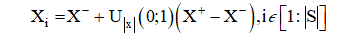

-Во-вторых, на данном этапе производим вычисление исходных значений фитнес-функции 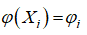 и определяем лучшее из этих значений

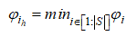

**Локальный поиск** выполняем для каждого из текущих положений частиц X_i с целью сбора локальной информации о ее окружении.
Этот поиск может быть реализован с помощью любого из детерминированных или стохастических алгоритмов локальной оптимизации.
Авторы алгоритма предлагают использовать линейный стохастический поиск.

**Вычисление суммарных сил**

На текущей итерации заряду частицы s_i ставим в соответствие величину

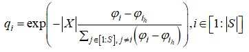

которая представляет собой нормированное значение фитнес-функции в текущем положении X_i этой частицы.
Здесь 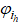 - минимальное достигнутое популяцией к данной итерации значение этой функции.
Множитель  |Х| добавлен с целью предотвращения слишком малых абсолютных значений величины под знаком экспоненциальной функции при высоких размерностях поискового пространства.
Аргумент этой функции во всех случаях неположителен, так что заряд  всегда положителен и принадлежит интервалу (0; 1].

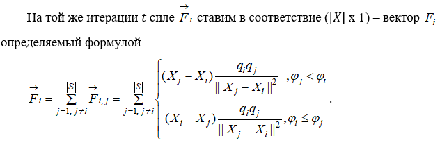

Из формулы выше следует, что частица с лучшим значением исследуемой функции притягивает частицу с худшими значениями этой функции, и наоборот - вторая частица отталкивает первую.
Из этой же формулы вытекает, что частица,имеющая на данной итерации значение фитнес-функции, равное , притягивает все остальные частицы популяции.

**Перемещение частиц** выполняем по правилу 

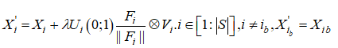

здесь лямбда - шаг перемещения (свободный параметр); 
компоненты вектора V_i имеют значения

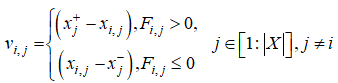

Формулы выше означают, что при перемещении частицы  из положения X_i в положение X'_i используем нормированную силу.
По каждому из измерений вектора Х перемещение производим с шагом случайного размера в направлении соответствующей верхней или нижней границ параллелепипеда П.
Частицу s_ib  на данной итерации не перемещаем.
**Окончание итераций**
В оригинальной версии алгоритма условием завершения вычислений является достижение заданного числа итераций i.
Авторы алгоритма рекомендуют использовать следующие значения свободных параметров: 
- число итераций локального поиска t в несколько раз превышает величину |X|;
- величина, определяющая максимально допустимую величину шага локального поиска, принимает значения от 10^(-2) до 10^(-4);
- максимальное число итераций t = 25|X|.
Авторы алгоритма выполнили широкое экспериментальное сравнение его эффективности с эффективностью многих известных популяционных и непопуляционных алгоритмов глобальной оптимизации.
Исследование показывает, что обычно алгоритм ЕМ показывает сравнимые, а часто лучшие результаты, чем другие алгоритмы.

