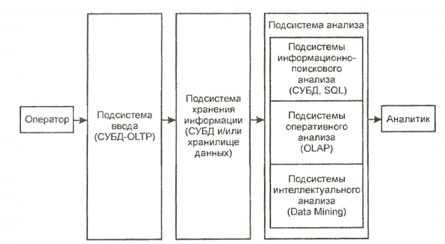

___
# Вопрос 58: Системы поддержки принятия решений. Многомерные данные и OLAP-технологии.
___

*Источники: билеты РБДиБЗ*

## Системы поддержки принятия решений

Система поддержки принятия решений, СППР, Decision Support System, DSS - компьютерная автоматизированная система, целью которой является помощь людям, принимающим решение в сложных условиях для полного и объективного анализа предметной деятельности. СППР возникли в результате слияния управленческих информационных систем и систем управления базами данных.

Для выполнения анализа СППР должна накапливать информацию, обладая
средствами ее ввода и хранения. 

Таким образом, СППР — это системы, обладающие средствами ввода, хранения и анализа данных, относящихся к определенной предметной области, с целью поиска решений.

Ввод данных в СППР осуществляется либо автоматически от датчиков, характеризующих состояние среды или процесса, либо человеком-оператором.

Система поддержки решений СППР решает две основные задачи:

- выбор наилучшего решения из множества возможных (оптимизация),
- упорядочение возможных решений по предпочтительности (ранжирование)

В обеих задачах первым и наиболее принципиальным моментом является выбор совокупности критериев, на основе которых в дальнейшем будут оцениваться и сопоставляться возможные решения (будем называть их также альтернативами). Система СППР помогает пользователю сделать такой выбор.

Система позволяет решать задачи оперативного и стратегического управления на основе учетных данных о деятельности компании.

Система поддержки принятия решений представляет собой комплекс программных инструментальных средств для анализа данных, моделирования, прогнозирования и принятия управленческих решений, состоящий из собственных разработок корпорации и приобретаемых программных продуктов (Oracle, IBM, Cognos).

Структура СППР:

Рассмотрим отдельные подсистемы более подробно.
- Подсистема ввода данных. В таких подсистемах, называемых OLTP (Online transaction processing), выполняется операционная (транзакционная) обработка данных. Для реализации этих подсистем используют обычные системы управления базами данных (СУБД).
- Подсистема хранения. Дпя реализации данной подсистемы используют
современные СУБД и концепцию хранилищ данных.
- Подсистема анализа. Данная подсистема может быть построена на основе:

    • подсистемы информационно-поискового анализа на базе реляционных СУБД и статических запросов с использованием языка структурных запросов SQL (Structured Query Language);

    • подсистемы оперативного анализа. Для реализации таких подсистем применяется технология оперативной аналитической обработки данных OLAP (On-line analytical processing), использующая концепцию многомерного представления данных;

    • подсистемы интеллектуального анализа. Данная подсистема
    реализует методы и алгоритмы Data Mining ("добыча данных").

По взаимодействию с пользователем выделяют три вида СППР:

- пассивные помогают в процессе принятия решений, но не могут выдвинуть конкретного предложения;
- активные непосредственно участвуют в разработке правильного решения;
- кооперативные предполагают взаимодействие СППР с пользователем. Выдвинутое системой предложение пользователь может доработать, усовершенствовать, а затем отправить обратно в систему для проверки. После этого предложение вновь представляется пользователю, и так до тех пор, пока он не одобрит решение.

По способу поддержки различают:

- модельно-ориентированные СППР, используют в работе доступ к статистическим, финансовым или иным моделям;
СППР, основанные на коммуникациях, поддерживают работу двух и более пользователей, занимающихся общей задачей;
- СППР, ориентированные на данные, имеют доступ к временным рядам организации. Они используют в работе не только внутренние, но и внешние данные;
- СППР, ориентированные на документы, манипулируют неструктурированной информацией, заключенной в различных электронных форматах;
- СППР, ориентированные на знания, предоставляют специализированные решения проблем, основанные на фактах.

По сфере использования выделяют:

- общесистемные
- настольные СППР.

СППР позволяет облегчить работу руководителям предприятий и повысить ее эффективность. Они значительно ускоряют решение проблем в бизнесе. СППР способствуют налаживанию межличностного контакта. На их основе можно проводить обучение и подготовку кадров. Данные информационные системы позволяют повысить контроль над деятельностью организации. Наличие четко функционирующей СППР дает большие преимущества по сравнению с конкурирующими структурами. Благодаря предложениям, выдвигаемым СППР, открываются новые подходы к решению повседневных и нестандартных задач.

## Многомерные данные

Многомерные базы данных – разновидность реляционной модели, которая использует многомерные структуры для организации данных и выражают отношения между данными. Поддерживают неограниченное число значений в поле, и находят свое применение там, где необходима эффективная и простая работа с большими массивами символьной информации.

Технология многомерных баз данных — ключевой фактор интерактивного анализа больших массивов данных с целью поддержки принятия решения. Подобные базы данных трактуют данные как многомерные кубы, что очень удобно именно для их анализа.

Многомерные модели данных имеют три важных области применения, связанных с проблематикой анализа данных.

1. Хранилища данных интегрируют для анализа информации из нескольких источников.
2. Системы оперативной аналитической обработки (online analytical processing — OLAP) позволяют оперативно получить ответы на запросы, охватывающие большие объемы данных в поисках общих тенденций.
3. Приложения добычи данных служат для выявления знаний за счет полуавтоматического поиска ранее неизвестных шаблонов и связей в базах данных.

Основные свойства, присущие многомерным БД:

* Агрегируемость данных - рассмотрение информации на различных уровнях ее обобщения. В информационных системах степень детальности представления информации для пользователя зависит от его уровня: аналитик, пользователь, управляющий, руководитель.

* Историчность данных - предполагает обеспечение высокого уровня статичности собственно данных и их взаимосвязей, а также обязательность привязки данных ко времени.

* Прогнозируемость данных - подразумевает задание функций прогнозирования и применение их к различным временным интервалам.

Достоинства:

* В случае использования многомерных СУБД поиск и выборка данных осуществляется значительно быстрее, чем при многомерном концептуальном взгляде на реляционную базу данных, так как многомерная база данных денормализована, содержит заранее агрегированные показатели и обеспечивает оптимизированный доступ к запрашиваемым ячейкам.
* Многомерные СУБД легко справляются с задачами включения в информационную модель разнообразных встроенных функций, тогда как объективно существующие ограничения языка SQL делают выполнение этих задач на основе реляционных СУБД достаточно сложным, а иногда и невозможным.
* Общая простота системы, что позволяет осуществлять быстрое встраивание технологий многомерных СУБД в приложения.
* Относительно низкая общая стоимость владения

Недостатки:

* Необходимость привлечения высококвалифицированных программистов для малейших изменений структуры базы данных.
* Невозможность для конечного пользователя самостоятельно анализировать данные в порядке, не предусмотренном программистами.
* Неэффективное, по сравнению с реляционными базами данных, использование внешней памяти

___

## OLAP-технологии

OLAP (on-line analytical processing) — набор технологий для оперативной обработки информации, включающих динамическое построение отчётов в различных разрезах, анализ данных, мониторинг и прогнозирование ключевых показателей бизнеса. В основе OLAP-технологий лежит представление информации в виде OLAP-кубов.

OLAP-кубы содержат бизнес-показатели, используемые для анализа и принятия управленческих решений, например: прибыль, рентабельность продукции, совокупные средства (активы), собственные средства, заемные средства и т.д.

Бизнес-показатели хранятся в кубах не в виде простых таблиц, как в обычных системах учета или бухгалтерских программах, а в разрезах, представляющих собой основные бизнес-категории деятельности организации: товары, магазины, клиенты, время продаж и т. д.

Благодаря детальному структурированию информации OLAP-кубы позволяют оперативно осуществлять анализ данных и формировать отчёты в различных разрезах и с произвольной глубиной детализации. Отчёты могут создаваться аналитиками, менеджерами, финансистами, руководителями подразделений в интерактивном режиме для того, чтобы быстро получить ответы, на возникающие ежедневно вопросы, и принять правильное решение. При этом сотрудникам, для создания отчетов не нужно прибегать к услугам программистов, на что обычно уходит немало времени.

Из OLAP-куба может быть составлен обычный плоский отчёт. По столбикам и строчкам отчёта будут бизнес-категории (грани куба), а в ячейках показатели.

